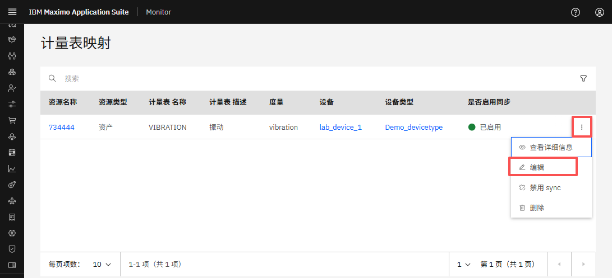
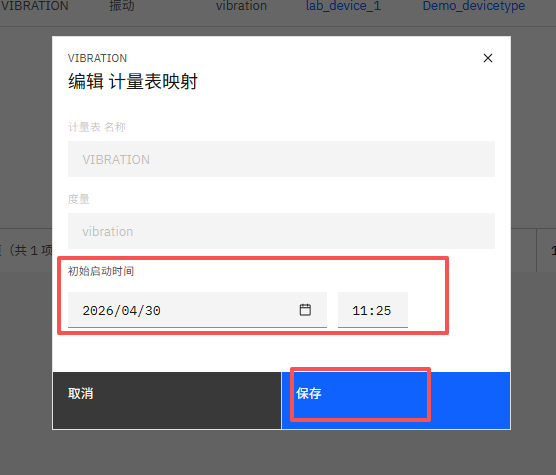
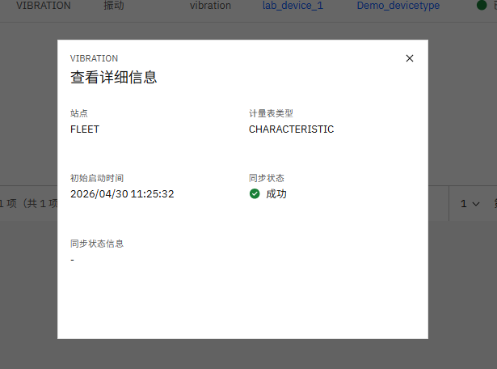

# 目标
在本练习中，您将学习如何：

* 编辑仪表/指标映射

---
**开始之前：**

本练习要求您已经：

1. 完成[所有实验](prereqs.md)所需的前置条件
2. 完成[之前的练习](setup.md)
 
---

按照以下步骤编辑仪表/指标映射：

1. 导航到 MAS Monitor UI 中的 计量表映射 页面。[参考之前的练习](setup.md/#访问仪表指标映射)。

2. 点击您要编辑的仪表映射旁边的三点菜单。
3. 从下拉菜单中选择 **Edit Mapping**。
  

4. 根据需要更新 **Initial Start Time** 字段。
5. 点击 **Save** 保存更改
  

6. 验证更新后的初始开始时间已反映在映射中。
  

!!! Note
    只有 **Initial Start Time** 字段可编辑。所有其他字段均为只读。

---
🎉 恭喜！您已成功学会如何编辑仪表/指标映射。