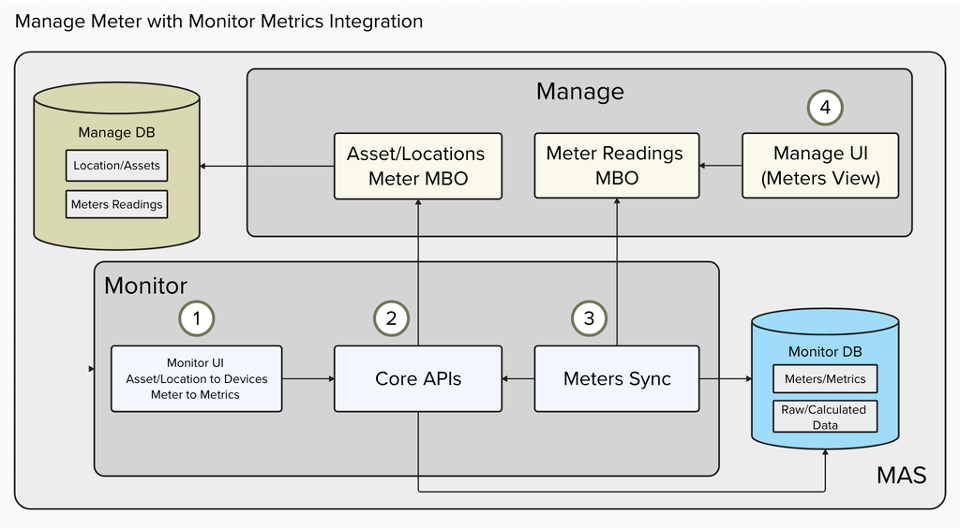

# 欢迎来到 Maximo Monitor 9.1 仪表-指标映射实验

在本实验中，您将学习如何在 Maximo Monitor 9.1 中配置和使用仪表-指标映射功能。此功能使您能够在 Monitor UI 中将仪表链接到指标，从而允许您直接在 Manage UI 中查看设备数据，并更高效地做出数据驱动的决策。

  

## 目标 

完成本实验后，您将能够：

* 在 Maximo Monitor 9.1 中配置仪表/指标映射
* 在 Manage UI 中查看仪表数据
* 切换仪表/指标映射的同步启用/禁用
* 编辑仪表/指标映射
* 删除仪表/指标映射
* 享受乐趣

!!! note
    完成整个实验的预计时间：1 小时

---

**更新时间：2025-06-26**

---