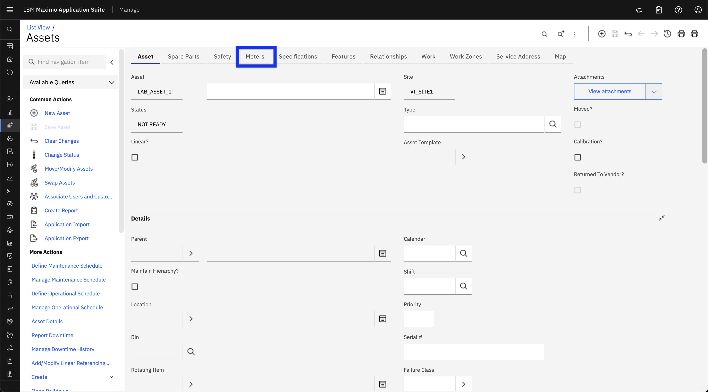
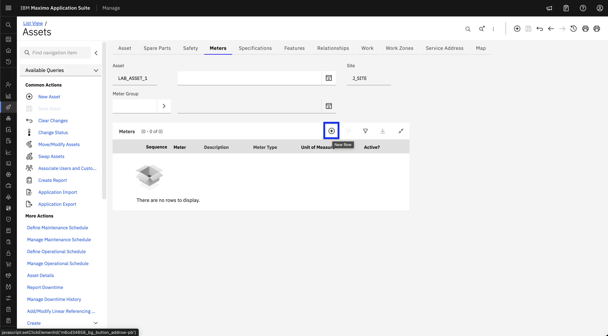
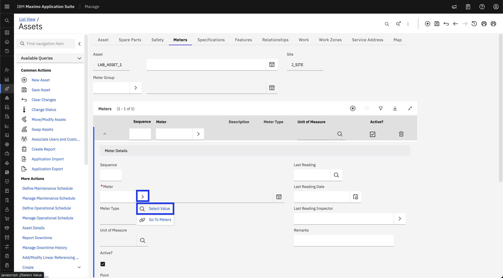
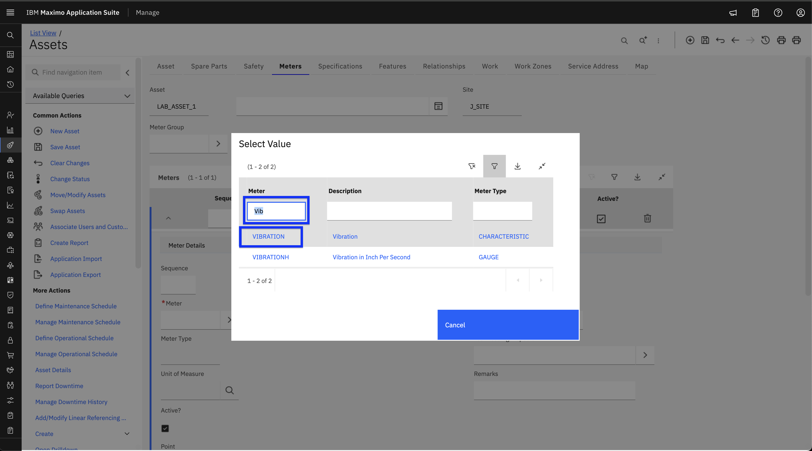
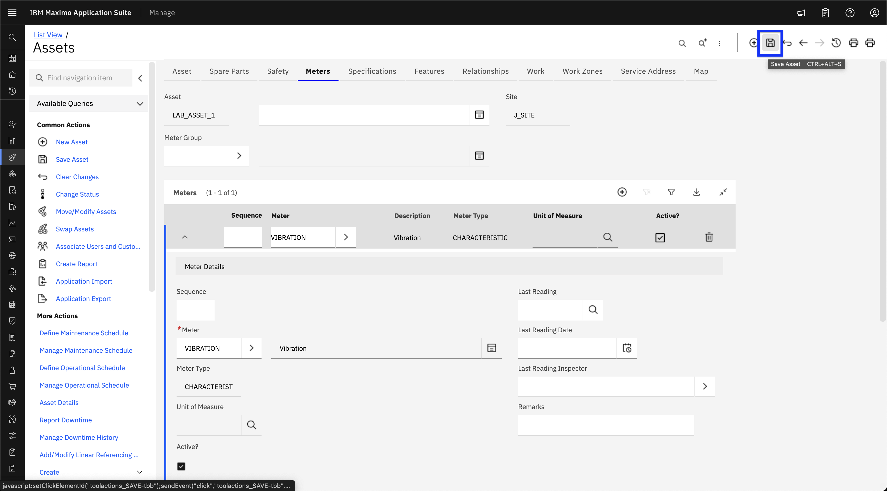
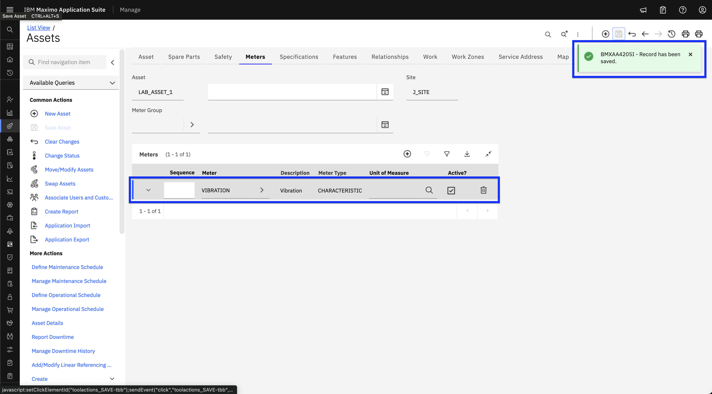
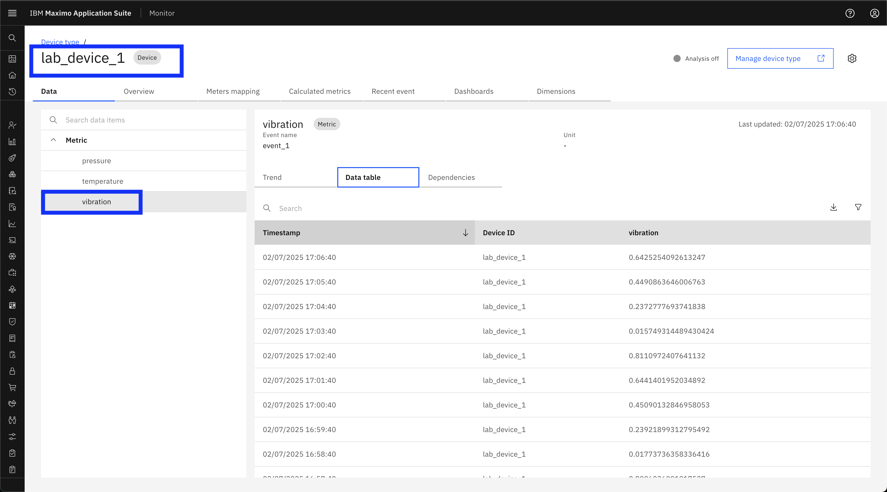

# 前置条件说明

以下是 Maximo Monitor 仪表/指标映射练习所需的前置条件。

!!! attention
    本实验需要 Maximo Application Suite 9.1 或更高版本。 
    MAS 应用程序授权必须为 `Limited` 或更高级别。

# 所有练习

所有练习要求您具备：

1.  一台配备 Chrome 浏览器和互联网连接的计算机。

2.  访问 Maximo Application Suite 9.1 环境的用户权限。 
您的练习协调员应该已经向您提供了访问信息。

3.  一个 IBM ID。如果您没有 IBM ID，可以在[这里](https://www.ibm.com/account/reg/signup?)获取： 
o 点击 `Login to MY IBM` 按钮 
o 点击 `Create an IBM ID` 链接

4.  测试您对 Maximo Application Suite 环境的访问。

5.  请完成以下练习。

!!! Attention
    您应该具有查看/创建/编辑/删除仪表映射的必要权限。

## 练习 1 - 在 Maximo Manage 中为资产或位置添加仪表

!!! Note
    要创建资产和位置，请参考 [Maximo Monitor 层次结构实验](../../monitor_hierarchy_9.1) 中的分步说明。

### 为资产添加仪表

1. 登录 MAS 并导航到 Manage UI 中的资产页面（**Manage → Assets → Assets**）： 
  

2. 按名称搜索资产并点击它以查看其仪表。
  

3. 点击 **Meters** 选项卡。
  

4. 点击添加仪表图标（圆圈中的 ➕）。
  

5. 点击 Meter 字段中的 **">"** 图标，然后从下拉菜单中点击 **Select value**。
  

6. 按名称搜索仪表并从仪表表中选择一个仪表。
  

7. 点击顶部的保存图标（💾）。
  

8. 验证仪表已添加到列表中。
  

### 为位置添加仪表

1. 登录 MAS 并导航到 Manage UI 中的位置页面（**Manage → Assets → Locations**）： 
  

2. 按名称搜索位置并点击它以查看其仪表。
  

3. 参考[上面的资产部分](#为资产添加仪表)并从步骤 3 继续完成该过程。自行练习该过程。

## 练习 2 - 创建并分配带有指标的设备

!!! Note
    有关此练习，请参考[设备和设备类型设置实验](../../monitor_device_devicetype_setup_9.1/)中的分步说明。

1. 在 Monitor UI 中创建带有指标的设备。
2. 为设备打开数据模拟器。
3. 将设备分配给练习 1 中创建的位置或资产。
  

!!! Note
    只有**数值型指标**可以映射到仪表。确保您已在设备类型中创建了数值型指标。
