# 目标
在本练习中，您将学习如何：

* 设置仪表/指标映射

---
**开始之前：**

本练习要求您已经：

1. 完成[所有实验](prereqs.md)所需的前置条件
 
---

## 为资产设置仪表/指标映射

1. 登录 MAS 并导航到 Monitor UI 中的资产页面（**Monitor → 设置 → 资产 (Monitor)**）。
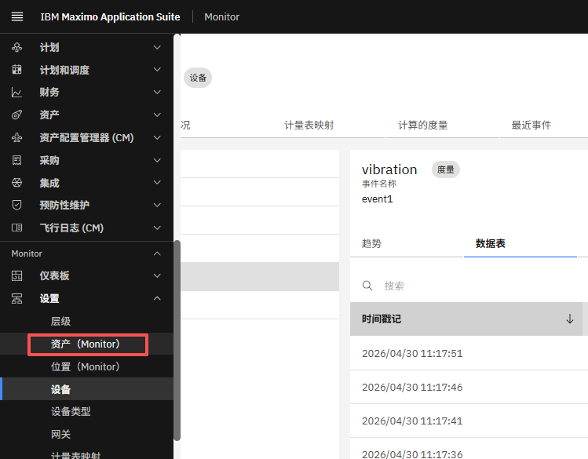  

2. 按名称搜索资产并点击它。
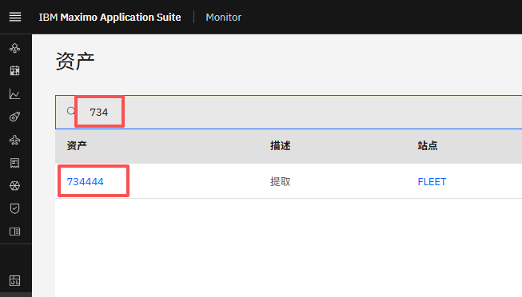  

3. 点击 **计量表映射** 选项卡以查看链接到资产的仪表列表。
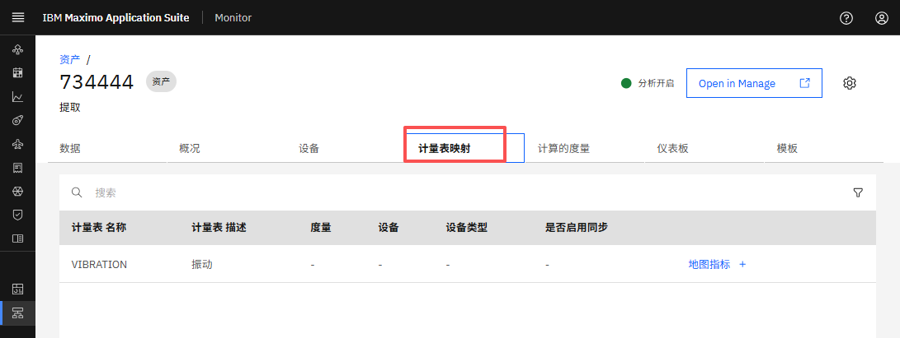  

4. 点击 **Map 指标** 以打开添加仪表映射模型窗口。
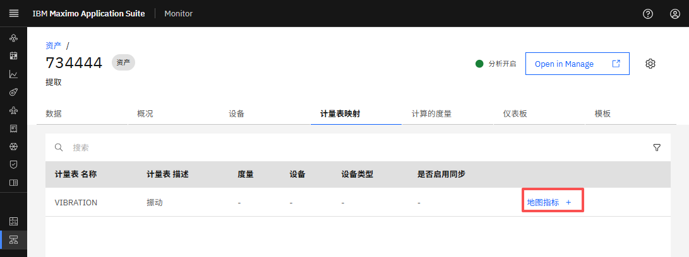  

5. 选择包含所需指标的设备，然后点击 **下一步**。
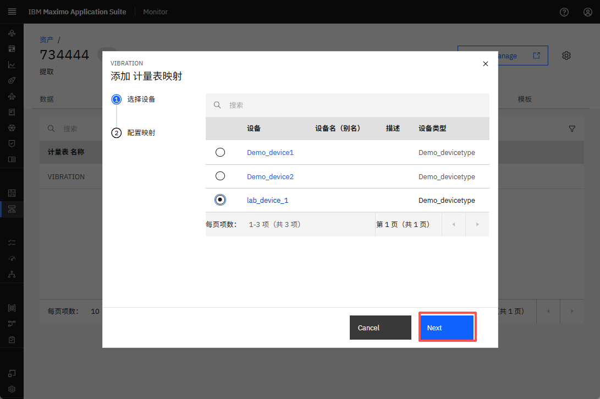  

6. 选择一个指标并设置初始日期，然后点击 **提交**。
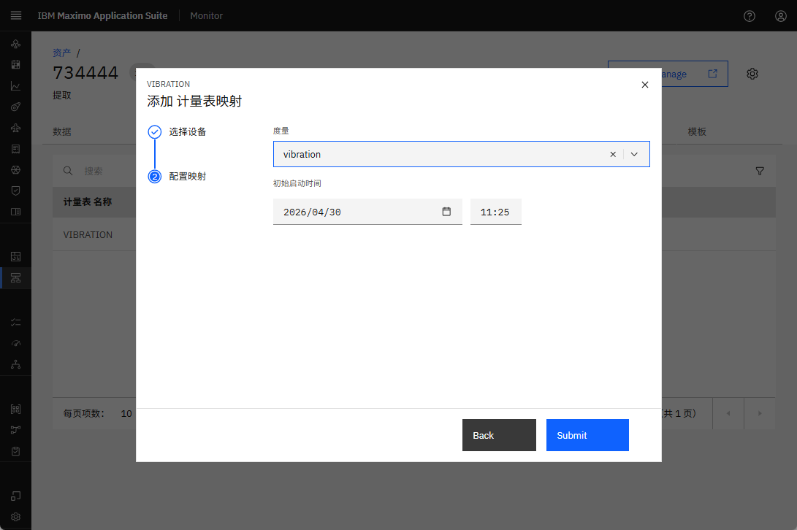  

7. 验证新映射是否出现在映射表中。
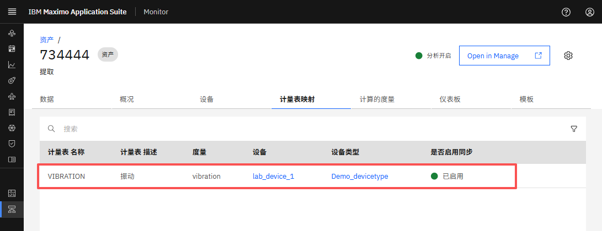  

## 为位置设置仪表/指标映射

1. 导航到 Monitor UI 中的位置页面（**Monitor → 设置 → 位置 (Monitor)**）。
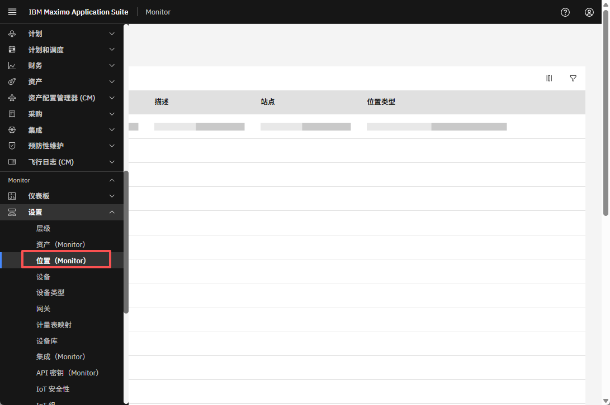  

2. 按名称搜索位置并点击它。
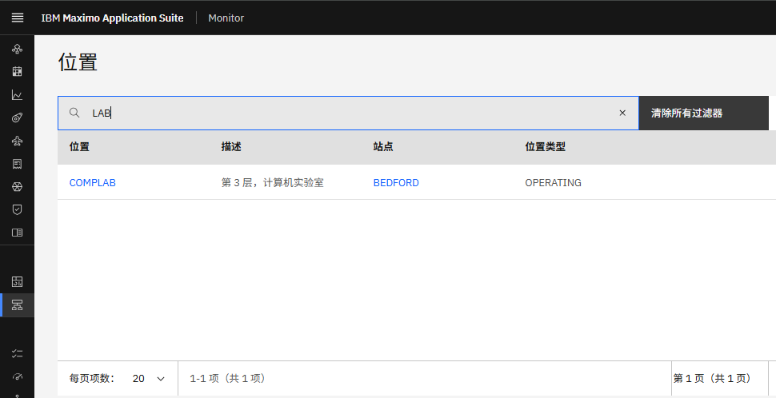  

3. 参考[上面的资产部分](#为资产设置仪表指标映射)并从步骤 3 继续完成该过程。自行练习该过程。

## 访问仪表/指标映射

您可以在一个集中位置查看所有仪表到指标的关联。要访问它们，请按照以下步骤操作：

1. 从侧边菜单栏导航到 **计量表映射** 页面（**Monitor → 设置 → 计量表映射**）
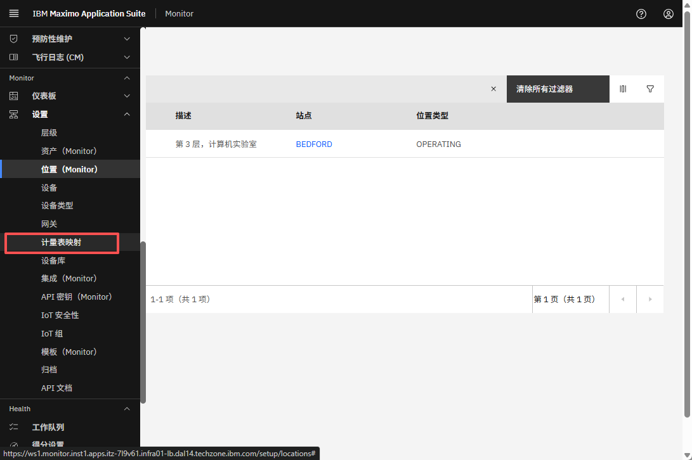  

2. 验证您可以查看所有映射到指标的资产和位置仪表。
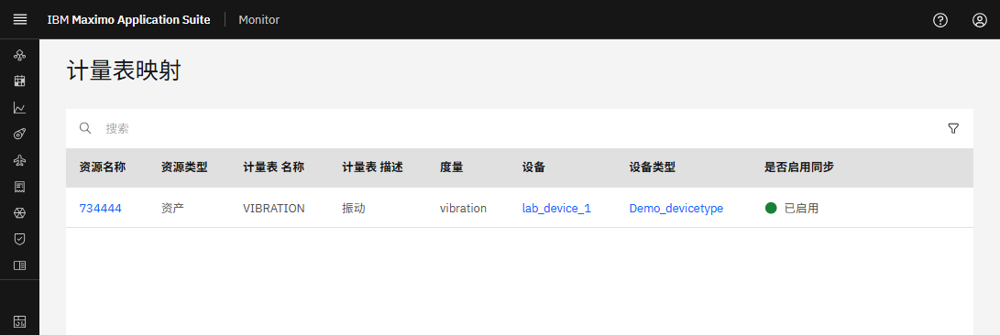  

3. 点击仪表映射旁边的三点菜单并选择 **View Details**。
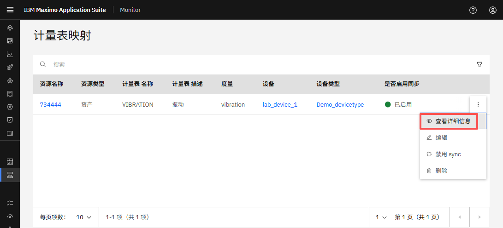  

4. 仪表映射详细信息面板将打开，显示配置。
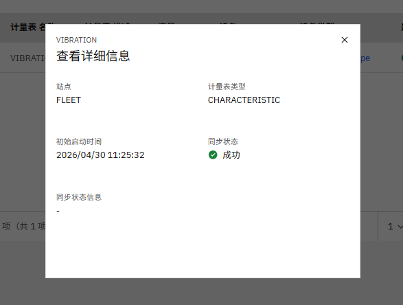  

---
🎉 恭喜！您已成功设置仪表/指标映射。