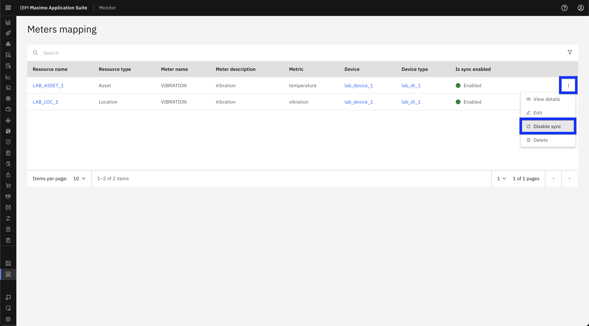
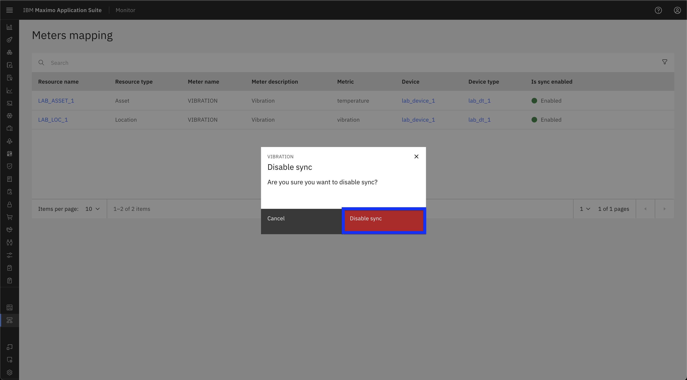
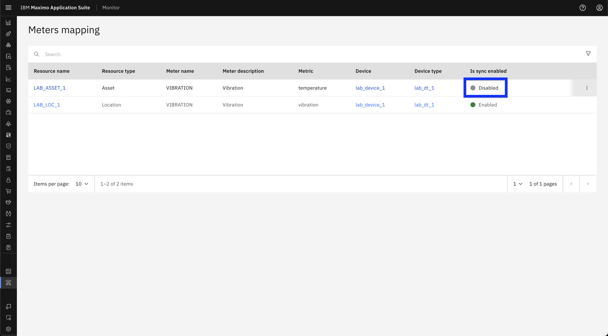
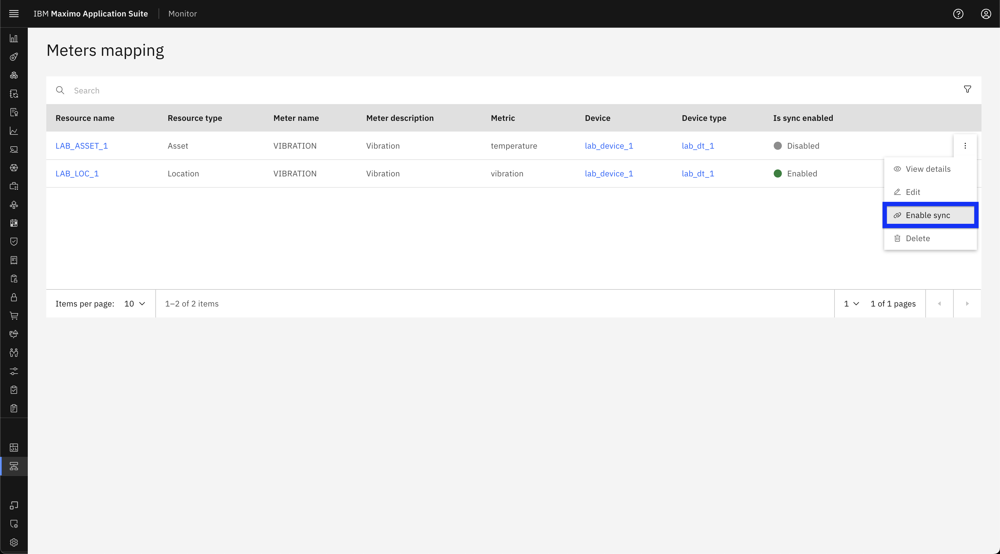
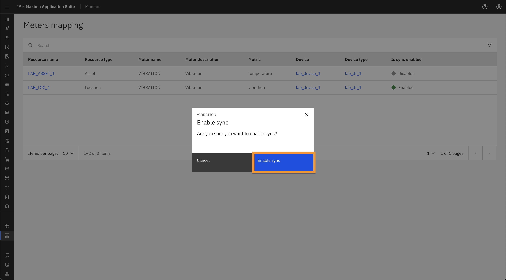
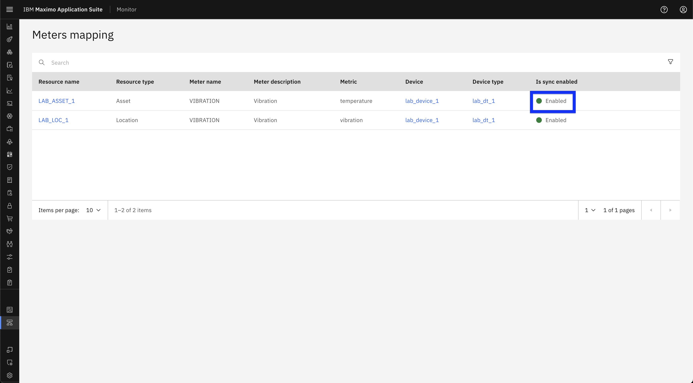

# 目标
在本练习中，您将学习如何：

* 切换仪表/指标映射的同步启用/禁用

---
**开始之前：**

本练习要求您已经：

1. 完成[所有实验](prereqs.md)所需的前置条件
2. 完成[之前的练习](setup.md)
 
---

### 禁用同步

1. 导航到 MAS Monitor UI 中的 Meter Mappings 页面。[参考之前的练习](setup.md/#访问仪表指标映射)。

2. 点击您要修改的仪表映射旁边的三点菜单。
3. 从下拉菜单中选择 **Disable Sync**。
  

4. 点击 **Disable sync** 确认操作。
  

5. 验证同步状态已在仪表映射表中相应更新。
  

### 启用同步

1. 导航到 MAS Monitor UI 中的 Meter Mappings 页面。[参考之前的练习](setup.md/#访问仪表指标映射)。

2. 点击您要修改的仪表映射旁边的三点菜单。
3. 从下拉菜单中选择 **Enable Sync**。
  

4. 点击 **Enable sync** 确认操作。
  

5. 验证同步状态已在仪表映射表中相应更新。
  

**预期结果：**

- 如果启用同步，仪表映射将开始向仪表推送数据。
- 如果禁用同步，数据将不再被推送。
- 确认同步状态已在仪表映射表中更新。

---
🎉 恭喜！您已成功学会如何切换仪表/指标映射的同步启用/禁用。