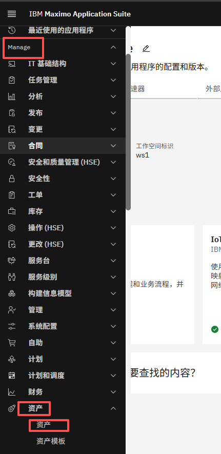
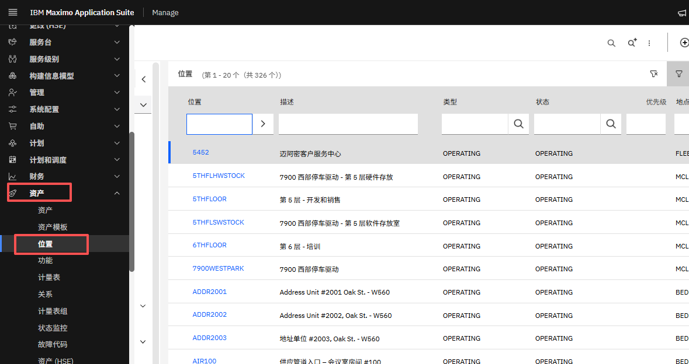
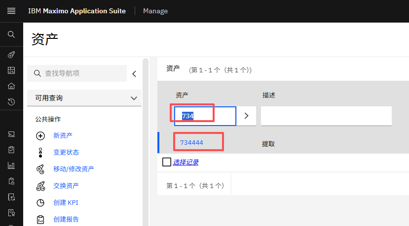
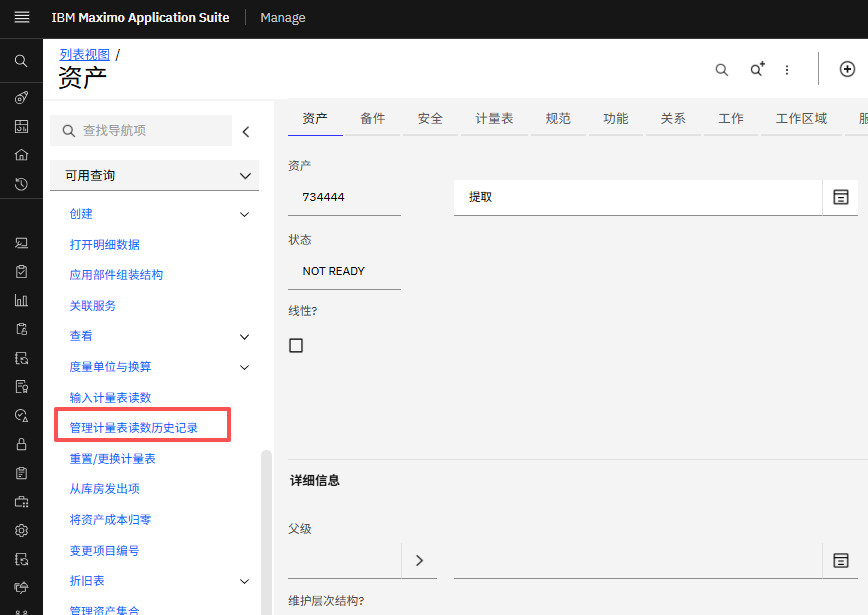
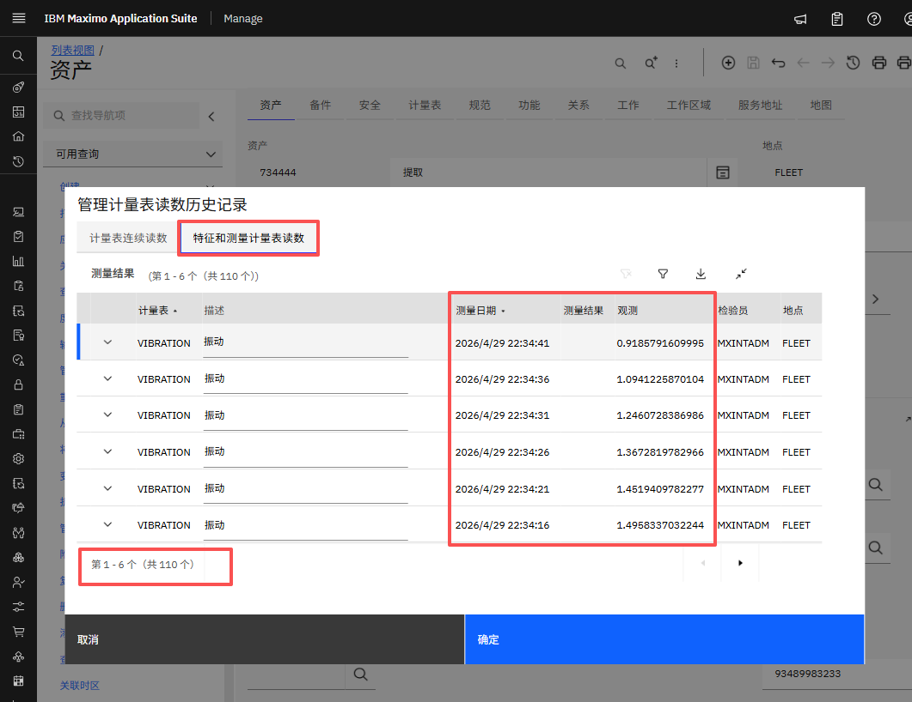

# 目标
在本练习中，您将学习如何：

* 在 Manage UI 中查看仪表数据

---
**开始之前：**

本练习要求您已经：

1. 完成[所有实验](prereqs.md)所需的前置条件
2. 完成[之前的练习](setup.md)

!!! Attention
    您应该具有在 Maximo Manage 中查看仪表读数的必要权限。

---

按照以下步骤在 Manage UI 中查看仪表数据：

1. 登录 MAS 并导航到 Manage UI 中的资产或位置页面： 
    - 对于**资产**：（**Manage → 资产 → 资产**）
      
    - 对于**位置**：（**Manage → 资产 → 位置**）
      

2. 按名称搜索资产或位置并点击它以查看其仪表。
  

3. 在左侧面板中，点击 **管理计量表读书历史记录**
  

4. 根据仪表类型点击 **特征和测量计量表读数**，以查看所有仪表数据。
  

!!! Attention
    指标数据每 5 分钟批量推送到仪表。请留出一些时间让读数显示在仪表视图中。

---
🎉 恭喜！您已成功学会如何在 Manage UI 中查看仪表数据。