# 目标
在本练习中，您将学习如何将自定义Modbus设备添加到设备库。

---
*开始之前：*  
本练习要求您已经：

1. 完成[所有实验](prereqs.md)所需的前提条件
2. 完成之前的练习

---

!!! note "MAS 9.1中的新功能"
    您可以添加自定义设备，例如PLC或OPC-UA服务器，或支持Modbus、BACnet和Json协议但在Maximo Monitor设备库中不可用的工业设备。之后，在设备页面上创建设备的任何人都可以使用相同的设备。 

假设Lenze i550 VFD设备不在预配置库中，您可以通过以给定格式上传CSV文件将此设备添加到设备库。 

- 导航到设备库页面： 
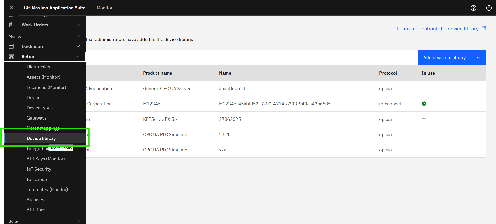 

- 可以使用CSV文件格式的设备设置添加Modbus设备。 
点击`Add device to library`并选择`Import device settings`选项： 
 

- 选择协议为`Modbus`  
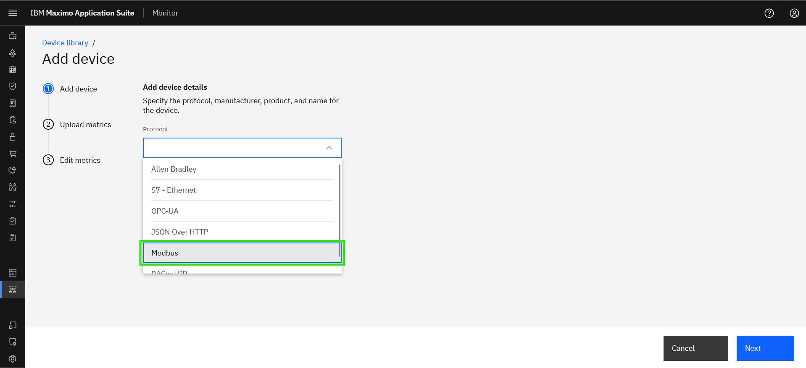 

- 输入设备详细信息并点击`Next`： 
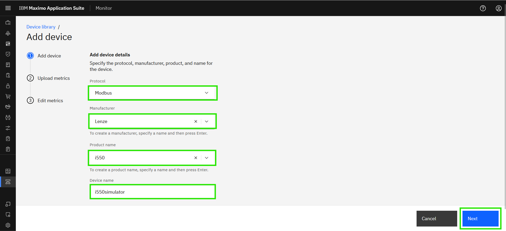 

!!! tip
    * 如果在选项中找不到制造商，可以添加新制造商。
    * 设备名称中的XX应该是您的姓名首字母缩写，以防其他人在同一Maximo Application Suite环境中进行此实验。

- 下载`example.xlsx文件` 
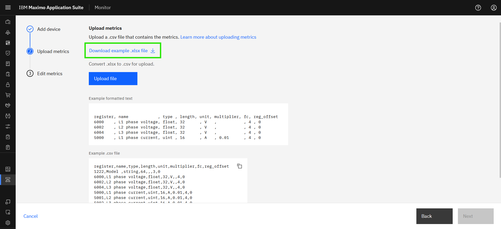 

- 打开Excel文件以在`metrics`工作表中填写数据点，模板中的每一列都提供了有关其用途的上下文以及完成相应单元格值的说明。需要注意的是，CSV中的每一行代表一个Modbus数据点。
 

- Modbus数据点详细信息可以在制造商用户手册/通信手册中找到。例如 - 对于Lenze i550，Modbus寄存器详细信息可在此[调试手册](https://www.lenze.com/product-information/PCS04-0000-0107-0/?contextType=PcsIdList&activeService=docFinder&documentId=OBJ_DOKU-0000000019-EN-015){target=_blank}中找到[第418页]
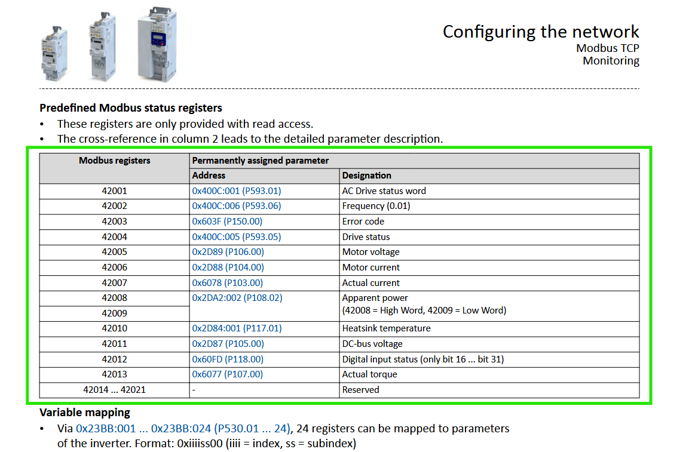 
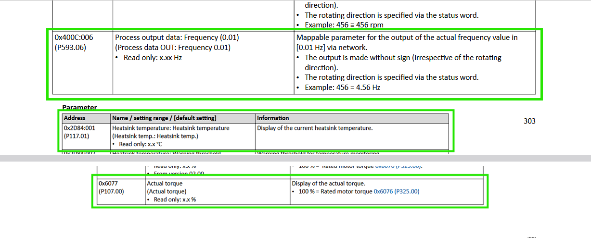 
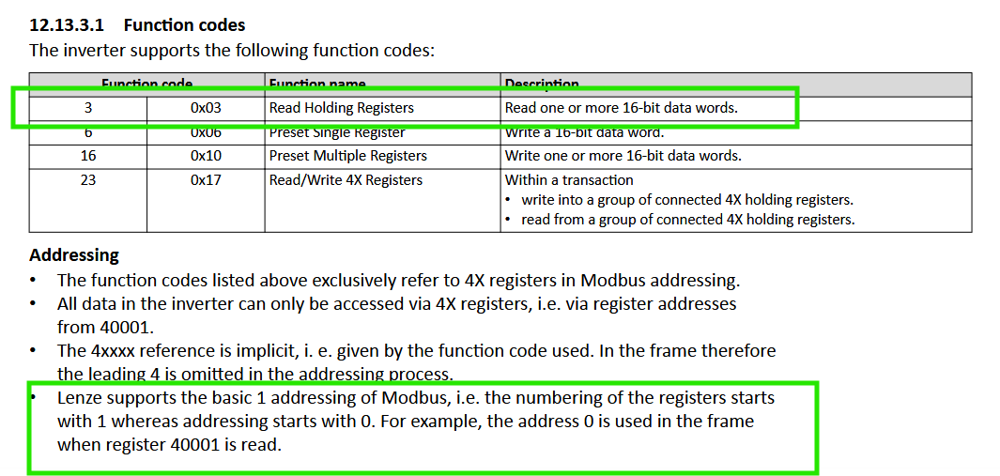 

- 使用modbus详细信息填写`Metrics`工作表：
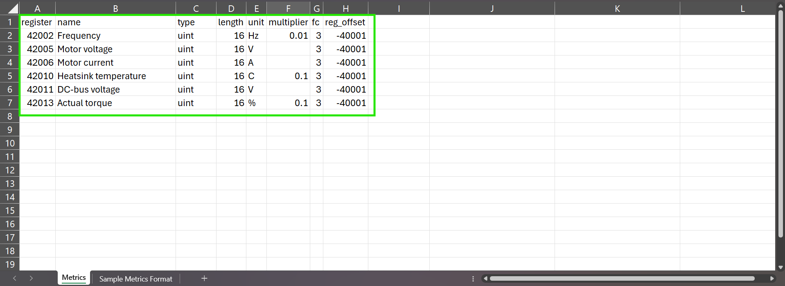 

# CSV模板输入示例

| Column_Name&emsp;&emsp;&emsp;&emsp;&emsp;| Description&emsp;&emsp;&emsp;&emsp;&emsp;&emsp;&emsp;&emsp;&emsp;&emsp;&emsp;&emsp;&emsp;&emsp;&emsp;&emsp;&emsp;&emsp;&emsp;&emsp;&emsp;&emsp;&emsp;&emsp;&emsp;&emsp;&emsp;&emsp;&emsp;&emsp;&emsp;&emsp;&emsp;&emsp;&emsp;&emsp;&emsp;&emsp;&emsp;&emsp;&emsp;&emsp;&emsp;&emsp;&emsp;&emsp;&emsp;&emsp;&emsp;&emsp;&emsp;&emsp;&emsp;&emsp;&emsp;&emsp;&emsp;&emsp;&emsp;&emsp;&emsp;&emsp;&emsp;&emsp;&emsp;&emsp;&emsp;&emsp;&emsp;&emsp;&emsp;&emsp;&emsp;&emsp;&emsp;&emsp;&emsp;|
|----------------------------------------------------------------|------------------------------------------------------------------------------------|
| <i>Register</i> | Register列期望值始终为十进制（基数10）而不是十六进制。实际转矩 - `42013`|
| <i>Name</i> | 应在此列中添加数据点的名称。该值将在Monitor中用作相关指标名称。`Actual Torque` |
| <i>Type</i>   |支持的格式`uint`、`sint`、`float`、`string`和`bool`。数据点的数据类型由其表示的物理属性和预期值范围决定。例如，如果像频率、转矩这样的值永远不会为负，则将其归类为无符号整数（uint）。 手册可能会明确将其标记为"uint"。如果数据可以包含负值，则将其视为有符号整数（int或sint），并且通常在文档中直接提及。浮点数（float）通常在手册中明确指定，用于需要小数精度的属性。 字符串由打包在16位无符号整数中的字符组成，在设备文档中可能被称为"ascii"或"char"。 线圈地址表示布尔值，存储简单的二进制数据（0或1）。|
| <i>Length</i>     | 1字节 = 8位   2字节 = 16位 = 1字（42013）  4字节 = 32位 = 2字（42025 + 42026）  12字节 = 96位 = 6字（30008到30013）|
| <i>Unit</i>     | 此列指示特定数据点报告数据的单位。这是一个可选参数，因为并非所有数据点都需要单位。|
| <i>Multiplier</i>     |用于从原始值获取精确值 在实际转矩的示例中，它被定义为x.x%，因此乘数为`0.1`。不适用于float、string、bool数据类型。|
| <i>Function Code[FC]</i>     |功能码通常根据寄存器编号的起始编号（旧的Modicon表示法）来决定。在示例中，4xxxx和3xxxx寄存器分别表示保持寄存器[FC3]和输入寄存器[FC4]。|
| <i>Register_Offset</i>     |在示例中，当读取寄存器40001时，帧中使用地址0，因此需要寄存器偏移量。寄存器偏移量是需要添加到寄存器地址以获得真实Modbus十进制地址的量。 由于寄存器采用FC格式（即42013），我们添加了-40001偏移量。如果寄存器地址是4097，偏移量只需要是-1|

- 要填写`metrics`工作表，请参考`Sample Metrics Format`工作表。
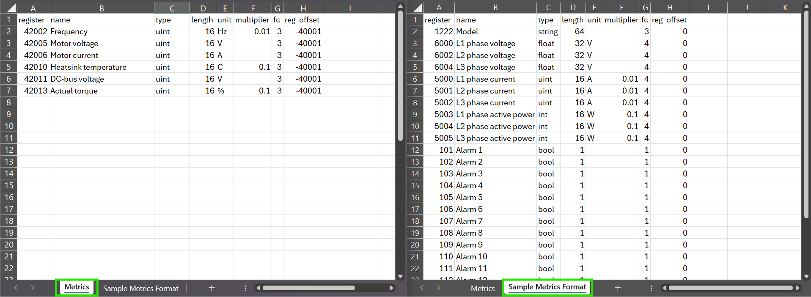 

!!! note
    将所需的数据点详细信息填写到Metrics工作表后，请将Excel文件`Metrics`保存为CSV格式以供上传。 

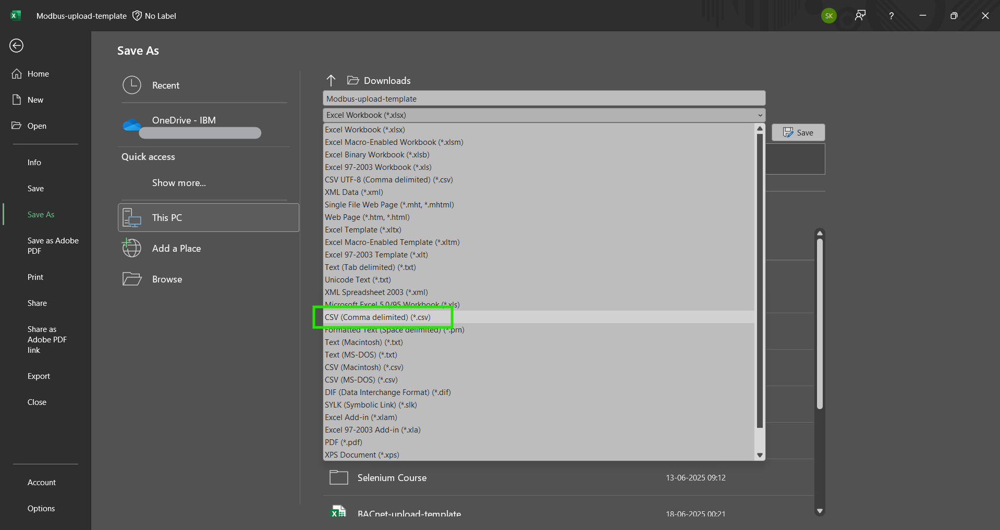 

- 上传CSV文件并选择`Next`
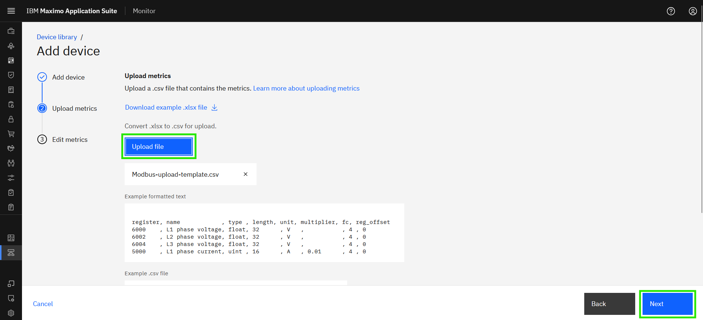 

- 您可以看到数据点的摘要，如果需要，可以在此处删除指标。完成后点击`Finish`： 
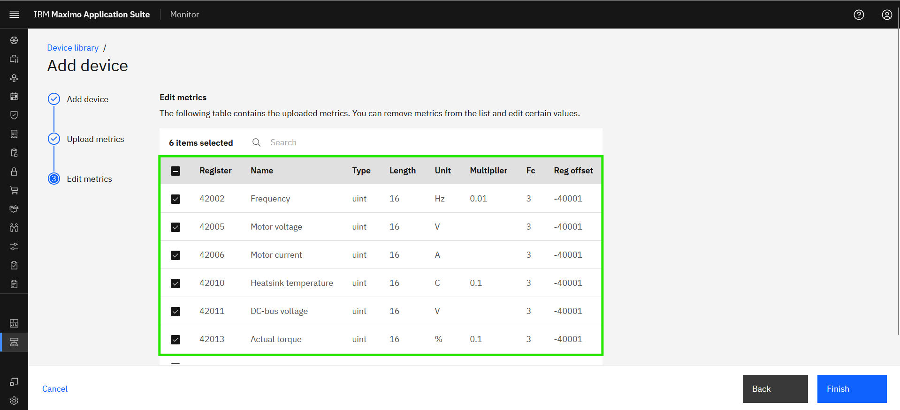 

!!! attention
    如果在上传CSV文件时看到`Bad Request`错误， 
    那么您可能需要检查CSV文件中每个指标是否缺少详细信息或格式无效。

- 您可以在设备库中看到新添加的设备： 
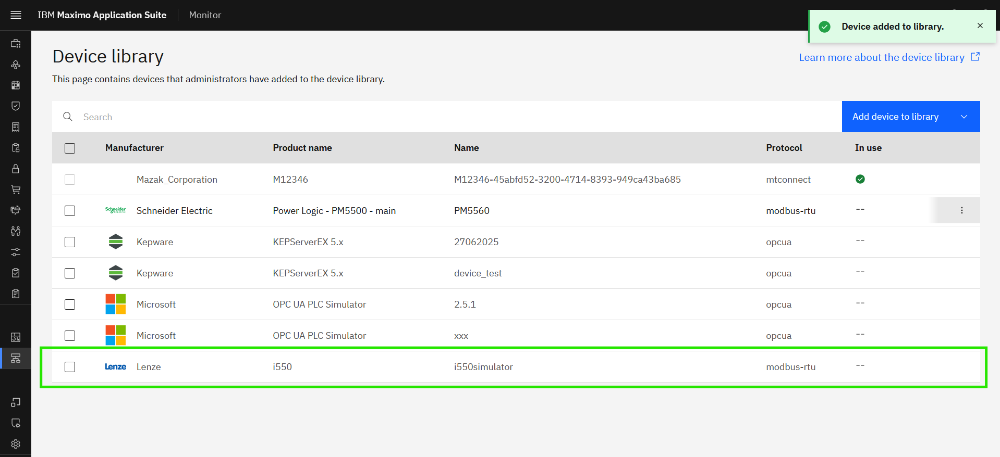
 
现在设备已准备好使用。尽情享受吧！！！🤗。 

---
恭喜您已成功将设备添加到设备库。 