# 目标
在本练习中，您将学习如何在Monitor中创建托管网关并添加您已添加到设备库的新设备。

---
*开始之前：*  
本练习要求您已经：

1. 完成[所有实验](prereqs.md)所需的前提条件
2. 完成之前的练习

---

#### 添加托管网关

登录到MAS：
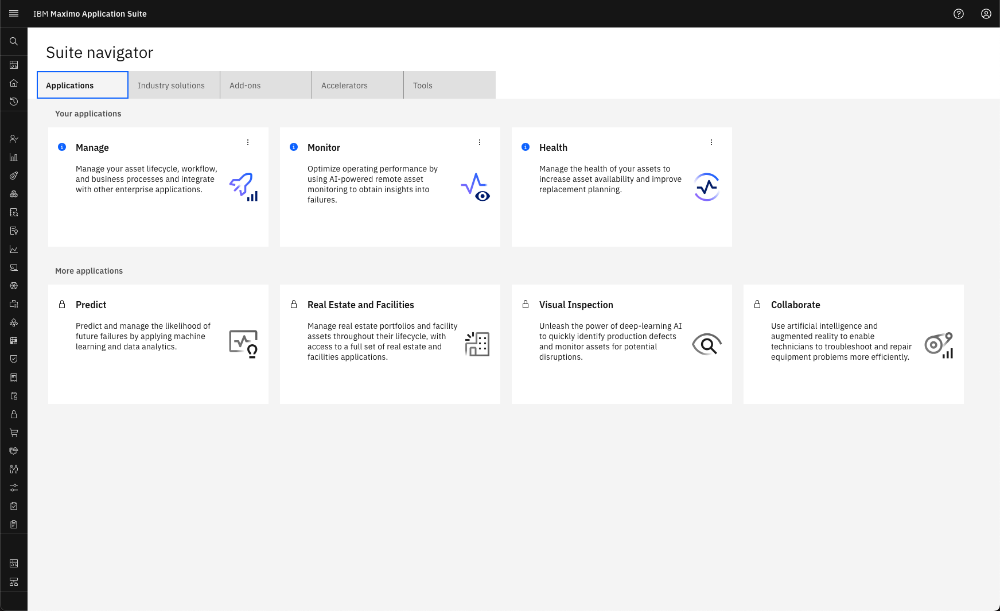  

在左侧菜单的Monitor部分下展开Setup并选择Gateways：

!!! note "MAS 9.1中的新功能"
    Monitor不再有主主页。与Monitor的所有交互都从左侧菜单的Monitor部分启动 

 
选择`Add gateway`：
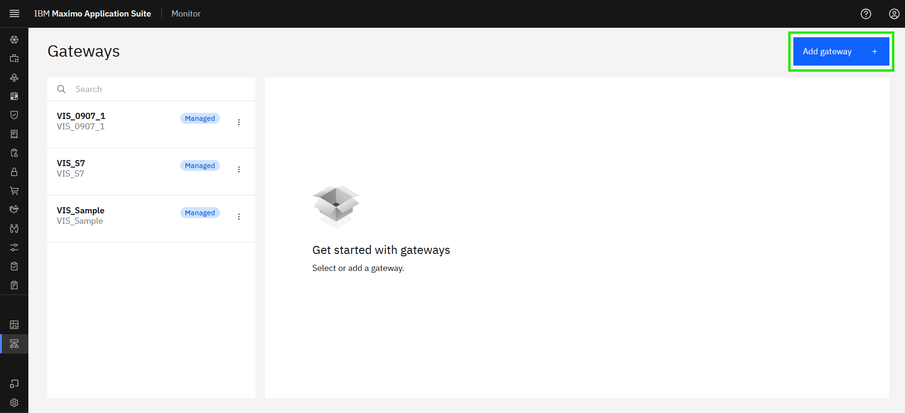  

定义网关ID `XX_MGD_GW_01`和网关类型`XX_MGD_GW_01`。

!!! tip
    网关ID和类型中的XX应该是您的姓名首字母缩写，以防其他人在同一Maximo Application Suite环境中进行此实验。

确保网关配置为Managed并点击`Save`：
  

您现在将看到新的托管网关，在网关列表和网关定义中都包含`Managed`标签：
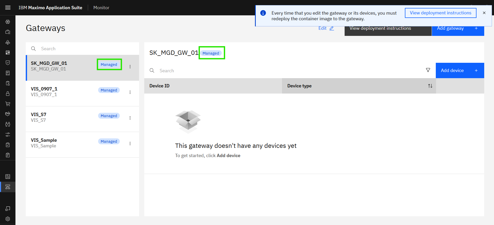 

!!! note
    凭据会自动"嵌入"到托管网关的docker镜像中。 
    这意味着凭据不会呈现给您，与其他网关配置类型不同。 

 

#### 将新设备添加到托管网关

在托管网关中点击`Add device`： 
[![添加设备]][添加设备]{target=_blank} 

`Use device library`将自动被选中，因为托管网关仅支持来自库的设备。只需点击`Continue`：  
[![使用设备库]][使用设备库]

!!! note
    网关类型定义了可以添加到网关的设备类型。 
    这由Monitor自动处理。  
    托管网关：来自设备库的OT设备。 
    标准/特权网关：IoT设备作为自定义设备添加。 

 
现在是添加Lenze i550模拟器设备的时候了。 
在制造商下拉列表中搜索`Lenze`并选择它。点击`Next`： 
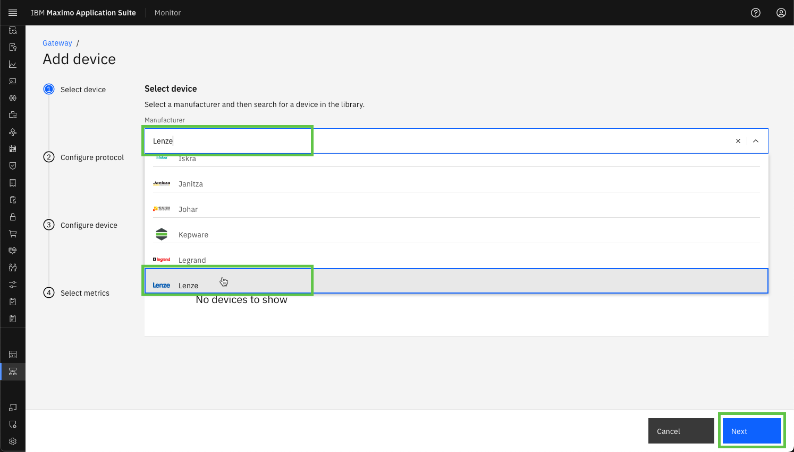  

选择i550产品，选择`i550simulator`并点击`Next`： 
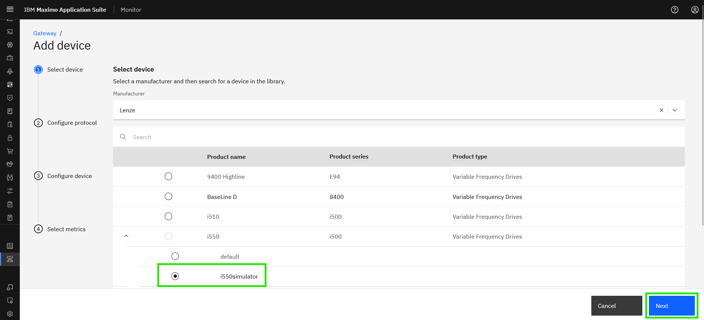  

选择`Modbus TCP`协议： 
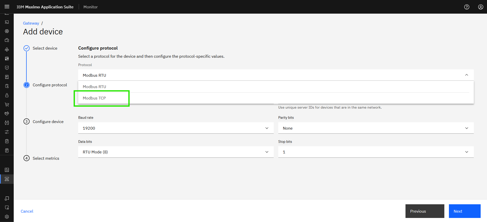

!!! tip 
    模拟器仅支持Modbus TCP协议，因此如果您选择其他协议将会失败。 

 
现在是使用模拟器的IP地址并将其与端口号10502组合的时候了，用`:`分隔，如`192.168.1.64:10502`。 
点击`Next`；
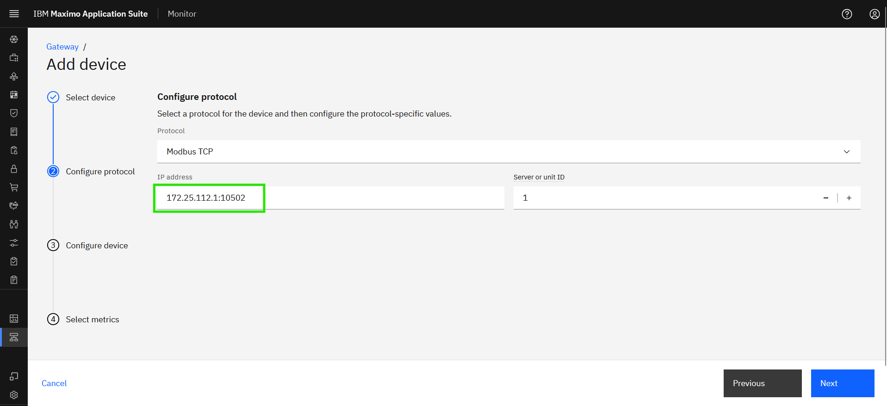

!!! tip 
    不要更改`Server or unit ID`，因为模拟器不支持它。 

 
将设备ID定义为`XX_Lenze_i550`，其中您将XX替换为您的姓名首字母缩写。 
您可以看到您选择的工业设备的产品类型，即Lenze i550的变频驱动器。 
点击`Device type`，您应该看到：
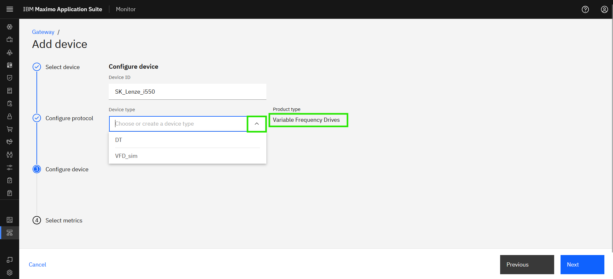  

您将创建自己的设备类型。由于您尚未这样做，您只需输入`XX_VFD`，其中您将XX替换为您的姓名首字母缩写： 
点击新设备类型以创建它并点击`Next`：
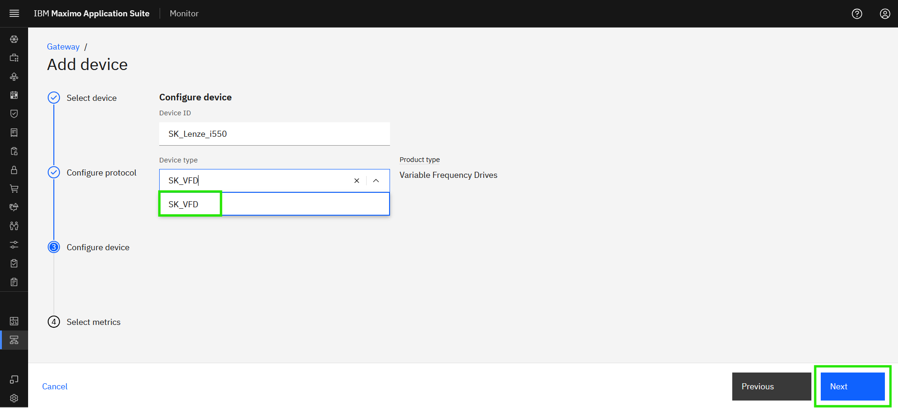

!!! tip 
    创建后，您可以从下拉列表中选择自己的设备类型。 

 
将数据频率定义为60000（60秒），当您选择指标时它将自动使用： 
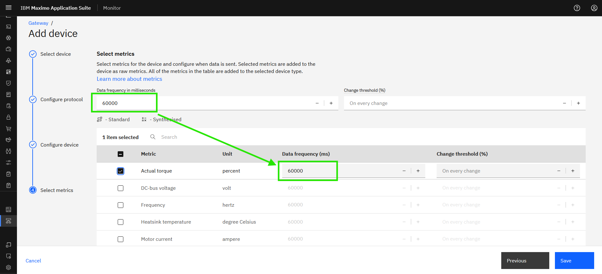  

选择所有指标。点击`Save`：
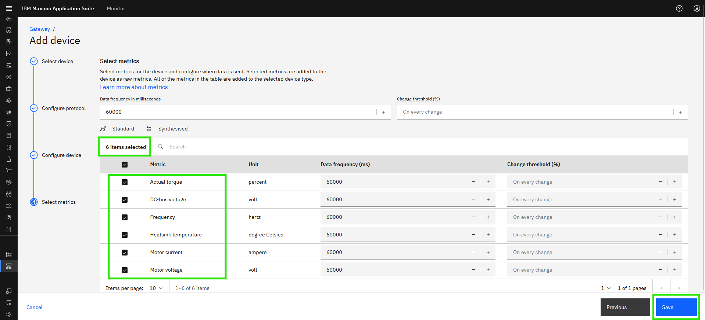

 
您现在将看到新添加的设备成为新托管网关的一部分：
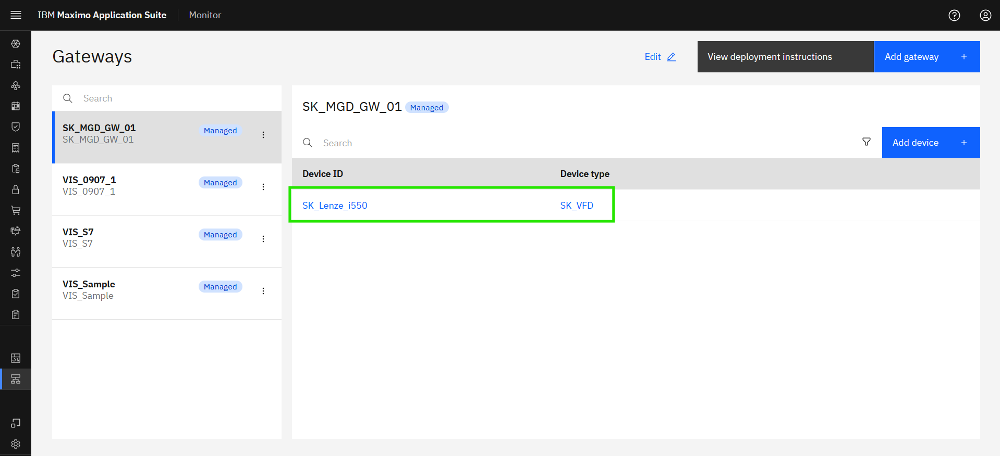  

---
恭喜您已成功在Monitor中创建托管网关并添加了设备库中新添加设备的实例。 

[添加设备]: img/add_device_01.png
[使用设备库]: img/add_device_02.png