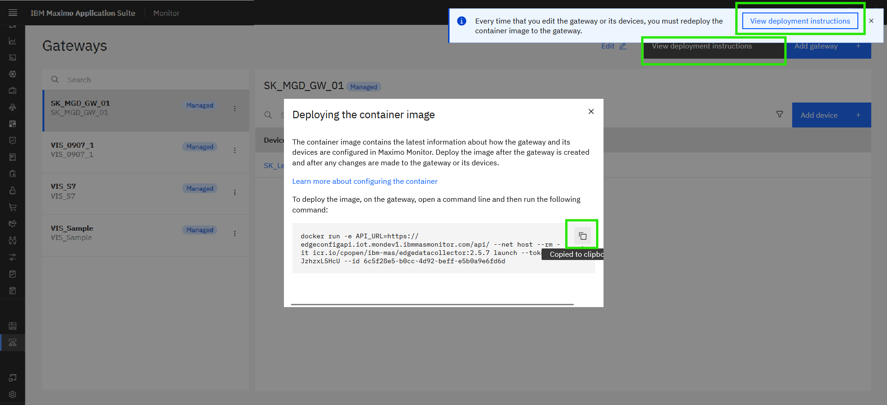
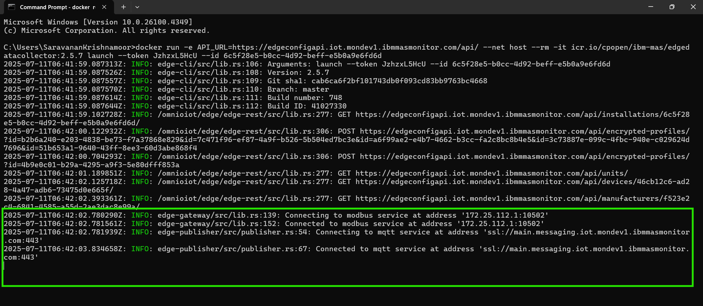
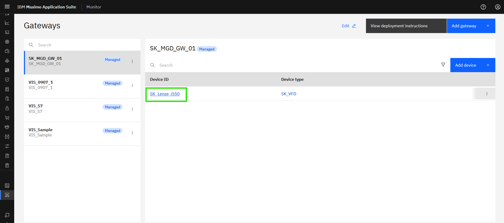
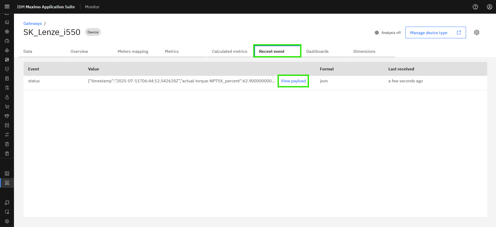
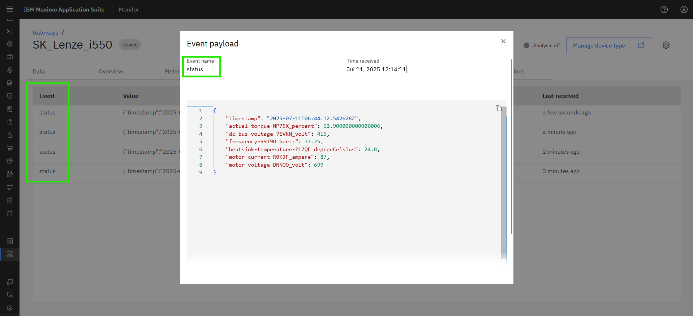
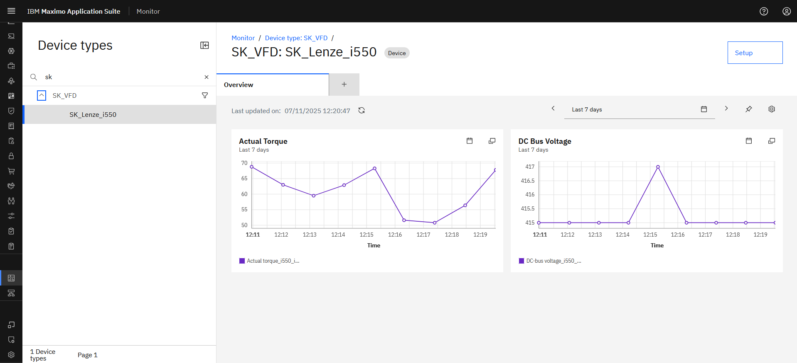

# 目标
在本练习中，您将学习如何：

* 部署托管网关
* 验证数据流入

---
*开始之前：*  
本练习要求您已经：

1. 完成[所有实验](prereqs.md)所需的前提条件以及本练习的前提条件
2. 完成之前的练习
3. 验证模拟器正在运行，如[练习1](setup_simulator.md){target=_blank}中所述

---

## 部署托管网关

在网关列表中查看您的托管网关时，按`View deployment instructions`。</br>
点击docker命令将其复制到剪贴板：
</br></br>

打开您想要运行托管网关的终端窗口（Mac/Linux）或命令窗口（Windows），然后从剪贴板粘贴docker命令行。点击回车执行它，您应该看到类似以下内容：


!!! tip "提示"
	您可以看到托管网关已成功使用modbus协议建立了与Modbus模拟器的连接。</br>
    其次，您还可以看到托管网关和Maximo Monitor之间建立了MQTT连接</br>
    
    第一次部署时，您可能会收到类似以下响应：`Unable to find image 'icr.io/cpopen/ibm-mas/edgedatacollector:2.5.7' locally`</br>
	请耐心等待Edge Data Collector docker容器下载并启动。</br>

    如果在网关/设备中进行了任何更改。我们需要重新部署docker命令。在重新部署之前，请使用`docker stop <Container ID>`停止旧的docker容器。

    要获取容器ID，请使用`docker ps`，它将提供正在运行的docker容器列表。


## 验证选定的Lenze VFD数据流入Monitor

点击打开`XX_Lenze_i550`设备：
</br></br>

导航到`Recent event`并等待一分钟（您知道添加设备时定义的那60000毫秒），直到第一条消息传入。</br>
</br></br>

点击`View payload`并查看发送到事件名称`status`的数据点：</br>
</br></br>

这些是您在将设备添加到托管网关时选择的数据点：

``` json
{
    "timestamp": "2025-07-11T06:44:12.542628Z",
    "actual-torque-NP75X_percent": 62.900000000000006,
    "dc-bus-voltage-7EVKN_volt": 415,
    "frequency-99T9D_hertz": 37.25,
    "heatsink-temperature-Z17QE_degreeCelsius": 24.8,
    "motor-current-R0KJF_ampere": 87,
    "motor-voltage-DNNOO_volt": 699
}
```
</br>

存储的数据可能会用于VFD设备的仪表板：</br>
</br></br>

---
恭喜您已成功部署并验证了连接性和数据流入，从而完成了本Maximo实验。