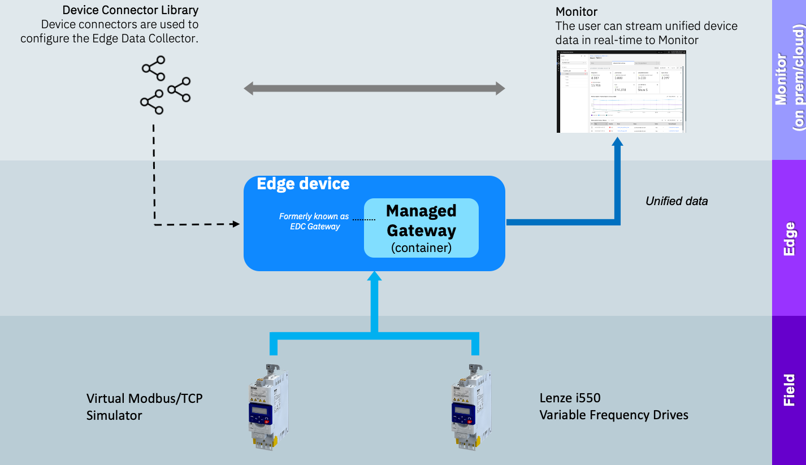

# 欢迎来到 Maximo Monitor 9.1 将 Modbus 自定义设备添加到设备库

!!! info
    在本实验中，您将学习通过`导入设备设置`[CSV文件上传]将Modbus自定义设备添加到设备库的步骤。

# 架构

  

!!! tip
    要了解更多关于Modbus协议的信息，请访问 [Simply Modbus.](https://www.simplymodbus.ca/){target=_blank}

本实验将涵盖：

* 通过导入设备设置将新设备添加到设备库
* 填写Modbus协议数据点的CSV模板
* 创建托管网关并添加自定义设备
* 在Maximo Monitor中验证来自添加的自定义设备的数据流。

!!! note
    完成整个实验的预计时间：1小时

---

**更新时间：2025-07-11**

---