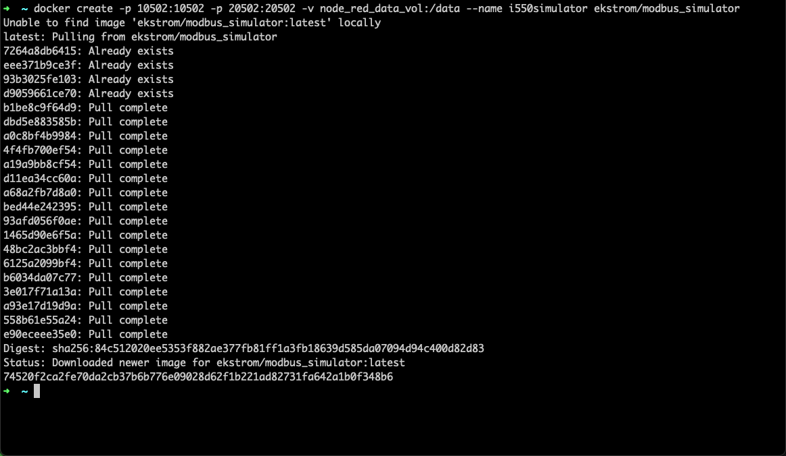
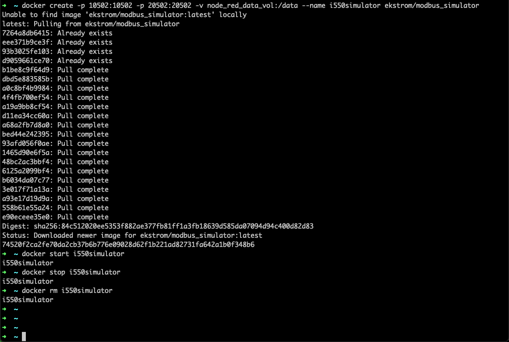

# 目标
在本练习中，您将学习如何使用 Docker 运行一个固定且就绪的 docker 容器与 modbus 模拟器。

!!! note
    创建的 docker 容器应该可以在以下架构上工作： 
    - x86（Windows/Linux/macOS） 
    - ARM（Linux/macOS）。

## 1. 安装 Docker

根据软件包和操作系统的不同，有不同的方法来安装 Docker 引擎。 
一个多平台选项是 Rancher Desktop。安装 Rancher Desktop 相当容易， 
您只需按照本指南操作：[本地运行 Docker](https://docs.rancherdesktop.io/getting-started/installation/){target=_blank} 

!!! tip
    Podman 和 Docker Desktop 也应该可以工作，但我没有测试过。

## 2. 创建 Docker 容器
打开终端或命令窗口并运行以下命令：

    docker create -p 10502:10502 -p 20502:20502 -v node_red_data_vol:/data --name i550simulator ekstrom/modbus_simulator

请耐心等待，即使您会看到以下消息：

    Unable to find image 'ekstrom/modbus_simulator:latest' locally

它需要拉取 docker 镜像。它已被命名为：`i550simulator`

## 3. 启动 Docker 容器

运行以下命令启动容器：

    docker start i550simulator

模拟器现在处于活动状态，随机和动态值将每 30 秒更改一次。
它将在后台运行，不会在终端/命令窗口中产生任何输出。

## 4. 停止并删除 Docker 容器

完成使用基于 docker 的模拟器后，您可以使用以下命令停止它：

    docker stop i550simulator

并使用以下命令删除容器：

    docker rm i550simulator

## 一个窗口中的所有 Docker 命令

---
恭喜您已成功使用预配置的 docker 容器设置了 modbus 模拟器环境。 