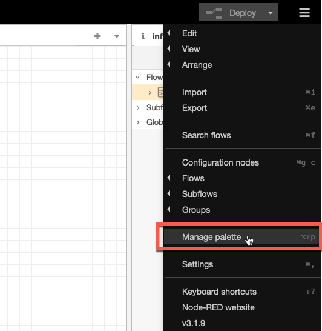
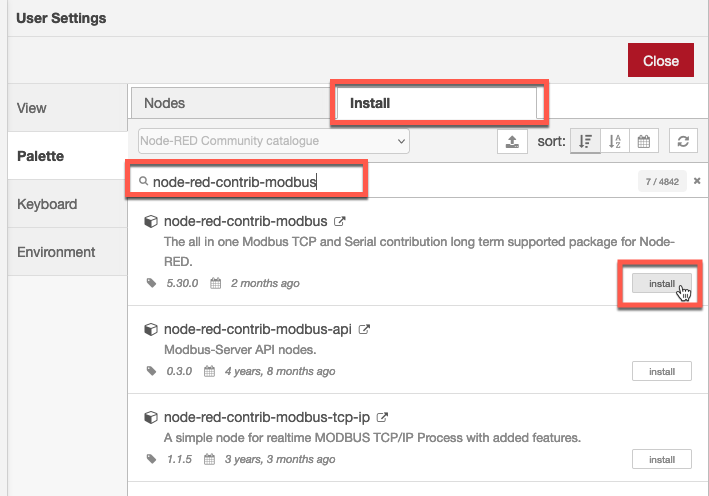
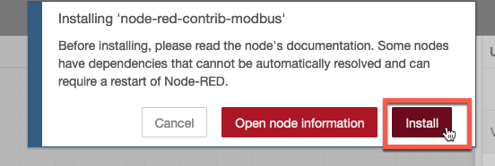
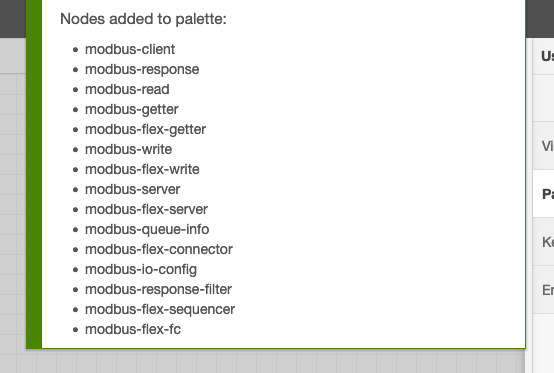
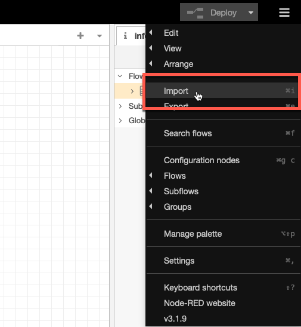
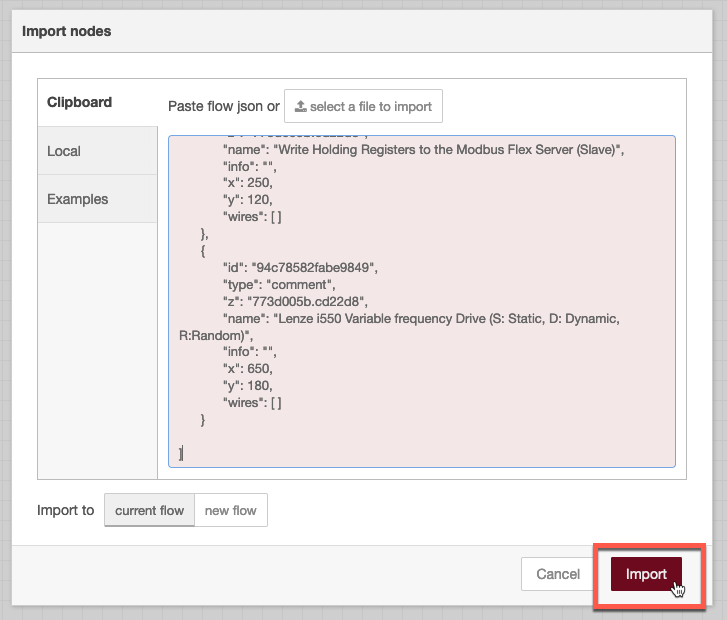
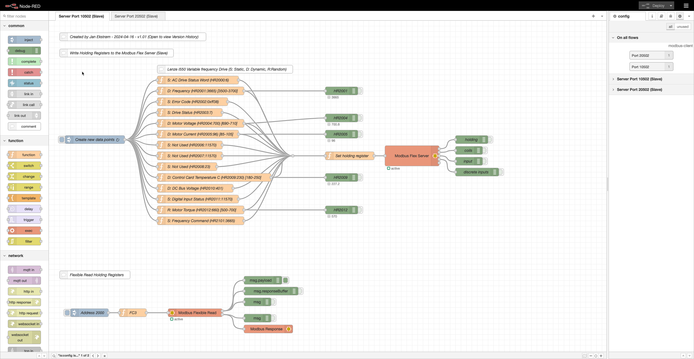
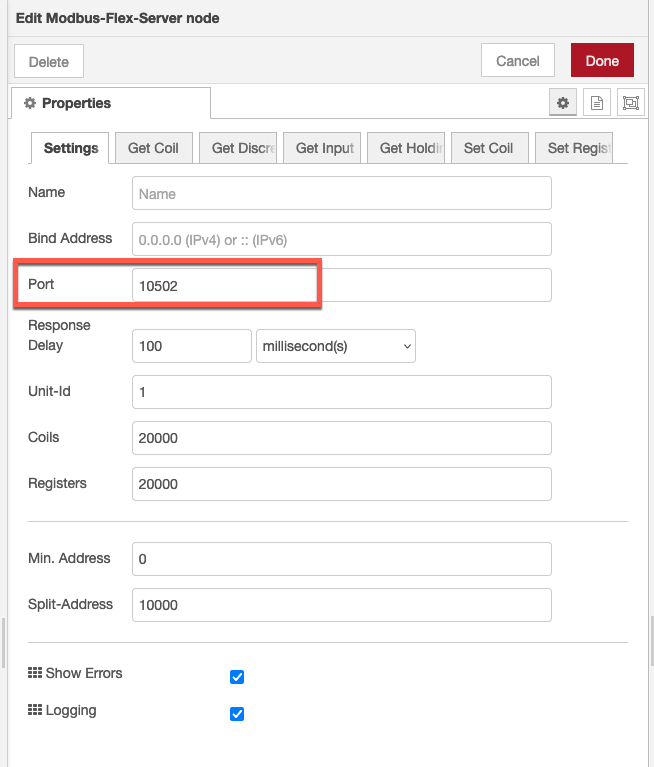
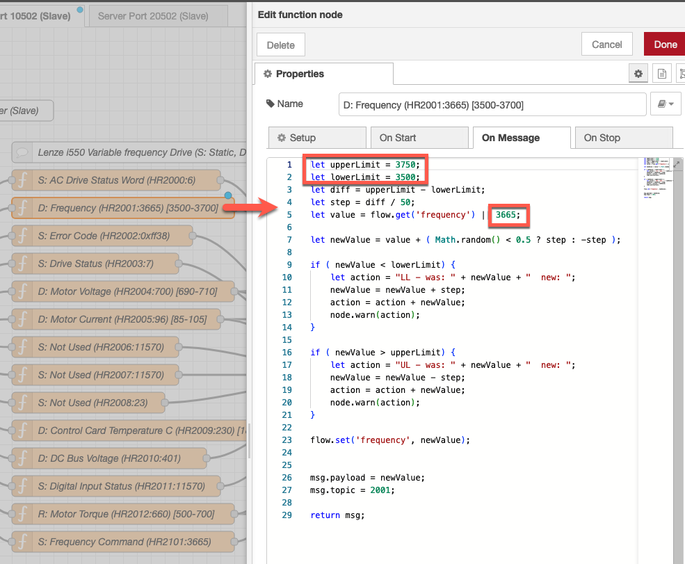
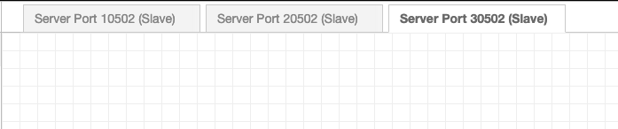

# 目标
在本练习中，您将学习如何：

* 在本地安装 Node-RED
* 添加所需的附加节点
* 安装 modbus 模拟器脚本

## 在本地安装 Node-RED

这是一个相当简单的步骤，您只需按照本指南操作：
[本地运行 Node-RED](https://nodered.org/docs/getting-started/local){target=_blank} 

安装并启动后，打开浏览器并启动 [Node-RED](http://localhost:1880/){target=_blank} 编辑器。 

!!! attention
    确保您运行的是 Node-RED v3+，即如果您已经在本地安装了现有的旧版 Node-RED 实例，请确保在继续之前升级它。

## 添加所需的附加节点

在加载 Node-RED 脚本之前，您需要添加所需的附加节点库。 
Node-RED 库依赖项： 
- node-red-contrib-modbus 

1. 点击右上角的汉堡菜单并选择 `Manage palette`。
  
2. 点击 `Install` 并在搜索字段中输入 `node-red-contrib-modbus` - 然后点击 `Install`。
  
3. 再次点击 `Install`。
  
4. 等待直到您看到新节点已安装。
  

## 安装 modbus 模拟器脚本

1. 下载 [flow](config/flows.json){target=_blank}
2. 启动 Node-RED
3. 点击汉堡菜单并选择 Import 
  
4. 点击 `select a file to import`
5. 选择在步骤 1 中下载的文件。
6. 点击 Import 
  
7. 删除 Flow 1
8. 点击 Deploy
9. 您的本地 Modbus 模拟器现在处于活动状态，随机和动态值将每 30 秒更改一次。
  

## 自定义提示和技巧

#### 更改端口号

如果您需要更改端口号，这在 Modbus Flex Server 节点中完成：
  

#### 更改动态范围

函数节点提供保持寄存器的内容（在 msg.topic 中定义）。 
如果需要，您可以更改上限、下限和默认值。
  

#### 添加另一个设备

您可以通过复制其中一个选项卡来添加另一个设备。只需记住在新选项卡中的 Modbus Flex Server 节点中更改端口号。
  

---
恭喜您已成功安装并准备了作为 modbus 模拟器运行的本地 Node-RED 实例。