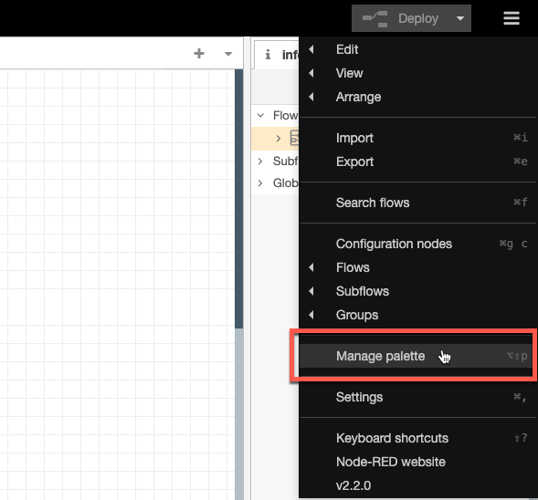
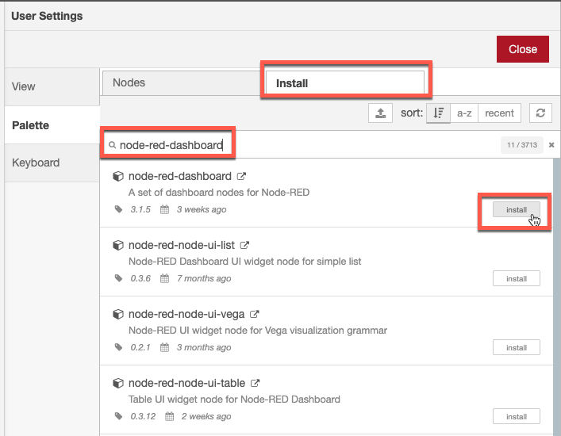
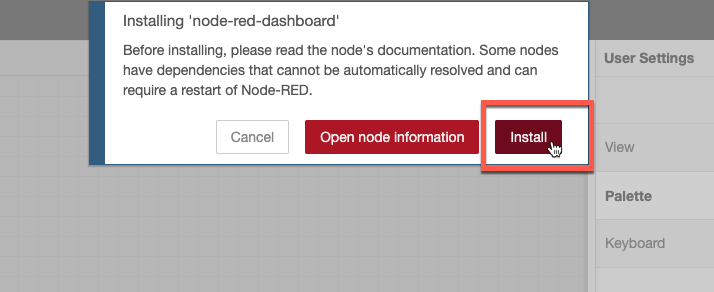
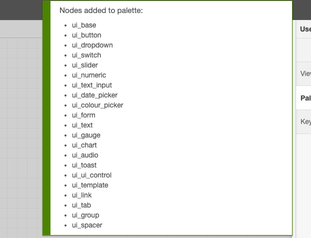

# 目标
在本练习中，您将学习如何：

* 在本地安装Node-RED
* 添加所需的附加节点

---
*开始之前：*  
本练习要求您已经：

1. 完成[所有实验](prereqs.md)所需的前提条件
 
---
##  在本地安装Node-RED

这是一个相当简单的步骤，您只需按照本指南操作：
[本地运行Node-RED](https://nodered.org/docs/getting-started/local){target=_blank} 

安装并启动后，打开浏览器并启动[Node-RED](http://localhost:1880/){target=_blank}编辑器。 

!!! attention
    确保您运行的是Node-RED v3+，即如果您已经在本地安装了现有的较旧Node-RED实例，请确保在继续之前升级它。

##  添加所需的附加节点

在加载Node-RED脚本之前，您需要添加所需的附加节点库。
Node-RED库依赖项： 
- node-red-dashboard 
- node-red-contrib-ui-upload 
- node-red-contrib-chunks-to-lines 

1. 点击右上角的汉堡菜单并选择`Manage palette`。
  
2. 点击`Install`并在搜索字段中输入`node-red-dashboard` - 然后点击`Install`。
  
3. 再次点击`Install`。
  
4. 等待直到您看到新节点已安装。
  
5. 对其他2个库重复步骤2-4：`node-red-contrib-ui-upload`和`node-red-contrib-chunks-to-lines`。

---
恭喜您已成功安装并准备好本地Node-RED实例。 
您现在可以在以下练习中模拟设备或网关了。