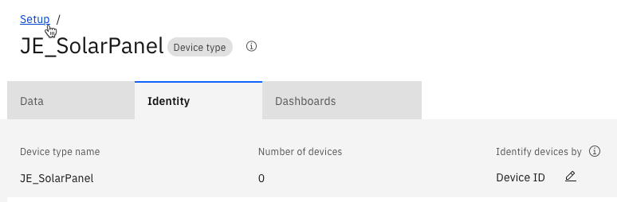
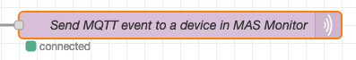
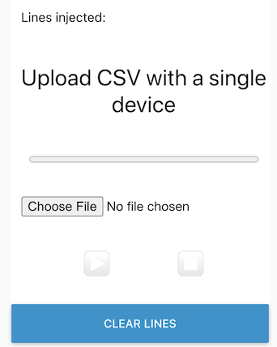
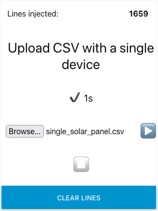
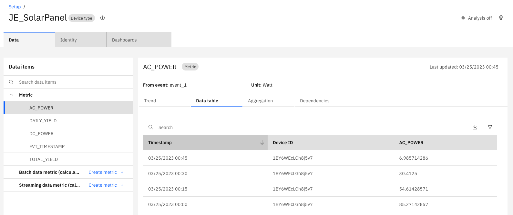
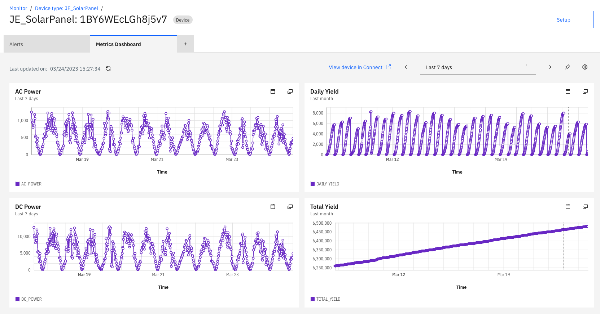

# 目标
在本练习中，您将学习如何设置Monitor以接收包含太阳能电池板数据的CSV文件中的数据。

* 在Monitor中创建设备类型并设置指标
* 在Monitor中创建设备以发送事件

## 在Monitor中创建设备类型并设置指标

### 创建设备类型

1. 在Monitor中转到Setup
2. 转到Devices选项卡
3. 点击+按钮创建设备类型
4. 选择Basic模板
5. Next
6. 输入设备类型名称，例如XX_SolarPanel（将XX替换为您的姓名首字母缩写）。 
   记下您给出的名称，因为您将在Node-RED流配置中需要它
7. Create

### 在设备类型中创建指标

1. 在Metrics部分下点击Add metric
2. 点击Add metric
     a. 为Metric输入AC_POWER
     b. 为Display name输入AC_POWER
     c. 为Event输入event_1
     d. 为Type选择NUMBER
     e. 为Unit输入Watt
3. 点击Add metric
     a. 为Metric输入DC_POWER
     b. 为Display name输入DC_POWER
     c. 为Event选择event_1
     d. 为Type选择NUMBER
     e. 为Unit输入Watt
4. 点击Add metric
     a. 为Metric输入DAILY_YIELD
     b. 为Display name输入DAILY_YIELD
     c. 为Event选择event_1
     d. 为Type选择NUMBER
5. 点击Add metric
     a. 为Metric输入TOTAL_YIELD
     b. 为Display name输入TOTAL_YIELD
     c. 为Event选择event_1
     d. 为Type选择NUMBER
6. 点击Add metric
     a. 为Metric输入EVT_TIMESTAMP
     b. 为Display name输入EVT_TIMESTAMP
     c. 为Event选择event_1
     d. 为Type选择TIMESTAMP
7. 点击Add
8. 在框中应用复选标记以`Use this as the default timestamp`
9. 指标应如下所示： 

9. 点击Save

## 在Monitor中创建代表CSV文件中设备的设备

1. 点击左上角的蓝色Setup链接，这将带您到设备类型列表 

2. 应选择您创建的设备类型
3. 点击`Add device +`
4. 为名称输入1BY6WEcLGh8j5v7
5. 选择Custom token
6. 输入Pasword1!
6. 点击Add and Close

## 导入Node-RED流以导入CSV

1. 下载[流](https://github.com/ekstrom-ibm/monitor_csv_importer/blob/main/V2/Monitor_CSV_to_MQTT_flow.json){target=_blank}
2. 启动Node-RED
3. 点击汉堡菜单并选择Import
4. 点击select a file to import
5. 选择步骤1中下载的文件。
6. 点击Import

## 为您的MAS Monitor环境配置Node-RED流

收集以下信息： 
* 上面创建的设备类型的名称，例如XX_SolarPanel 
* Messaging主机名应如下所示 
&ensp;[tenant/workspace].messaging.iot.[domain] 
&ensp;例如masdev.messaging.iot.monitordemo2.ibmmam.com 

1. 双击名为`Send MQTT event to a device in MAS Monitor`的紫色`mqtt out`节点
2. 点击Server旁边的铅笔图标
3. 在Server框中替换为您的Messaging主机名
4. 点击TLS configuration旁边的铅笔图标
5. 在Server Name框中替换为您的Messaging主机名
6. 取消选中`Verify server certificate`并点击Update
7. 设备的Client ID如下所示：`d:<tenant>:<device type>:<device ID>`
8. 在Client ID字段中，如果不相同，将masdev替换为您的租户/工作区名称
8. 在Client ID字段中将XX_SolarPanel替换为您的设备类型
9. 点击Security选项卡，输入`use-token-auth`作为用户名 
   并输入`Pasword1!`作为密码
10. 点击Update
11. 点击Done
12. 点击右上角的Deploy
13. 如果所有凭据输入正确，您现在应该在`mqtt out`节点下方看到一个绿点和`connected`： 

## 为单个设备运行Node-RED流

1. 从github下载[single_solar_panel.csv](https://github.com/ekstrom-ibm/monitor_csv_importer/blob/main/V2/single_solar_panel.csv){target=_blank}
2. 点击Node-RED右上角的向下箭头并选择Dashboard 

3. 点击启动箭头 

5. 点击"Upload CSV with a single device"下的Choose File或Browse 

6. 选择`single_solar_panel.csv`文件并点击右箭头播放按钮
7. 返回Node-RED流窗口
8. 在浅紫色`delay`节点下方显示剩余要发送到Monitor的消息数量
9. 在绿色`debug` Progress节点下方显示已发送到Monitor的消息数量
10. 等待直到浅紫色`delay`节点下方的数字显示0。 
Progress节点应显示1659。 

11. 所有数据已被导入Monitor

## 验证数据在Monitor中

1. 在Monitor中转到Setup
2. 点击实验中较早创建的设备类型
3. 点击黑色按钮"Set up device type"
4. 在左侧打开Metric，然后选择AC_POWER
5. 点击Data table查看该指标的值 
  

---

恭喜！您已将CSV文件中的数据导入Monitor。 
现在您可以探索在Monitor中创建计算数据指标和仪表板。 
可能是这样的： 
  

!!! attention
    不再使用时，请归档并删除您的设备类型。