# 目标
在本练习中，您将学习如何设置Monitor以接收包含太阳能电池板数据的CSV文件中的数据，并通过网关发送数据。网关将在Monitor中创建设备。

* 在Monitor中创建设备类型并设置指标
* 在IoT中创建网关以将事件发送到Monitor中的设备类型
* 配置Node-RED流
* 运行Node-RED流
* 验证设备和数据在Monitor中

## 在Monitor中创建设备类型并设置指标

!!! tip
    如果您已经完成了上一个练习，则跳到[在IoT中创建网关并注册设备](#create-a-gateway-in-iot-and-register-a-device)并重用设备类型设置。

### 创建设备类型

1. 在Monitor中转到Setup
2. 转到Devices选项卡
3. 点击+按钮创建设备类型
4. 选择Basic模板
5. Next
6. 输入设备类型名称，例如XX_SolarPanel（将XX替换为您的姓名首字母缩写）。 
   记下您给出的名称，因为您将在Node-RED流配置中需要它
7. Create

### 在设备类型中创建指标

1. 在Metrics部分下点击Add metric
2. 点击Add metric
     a. 为Metric输入AC_POWER
     b. 为Display name输入AC_POWER
     c. 为Event输入event_1
     d. 为Type选择NUMBER
     e. 为Unit输入Watt
3. 点击Add metric
     a. 为Metric输入DC_POWER
     b. 为Display name输入DC_POWER
     c. 为Event选择event_1
     d. 为Type选择NUMBER
     e. 为Unit输入Watt
4. 点击Add metric
     a. 为Metric输入DAILY_YIELD
     b. 为Display name输入DAILY_YIELD
     c. 为Event选择event_1
     d. 为Type选择NUMBER
5. 点击Add metric
     a. 为Metric输入TOTAL_YIELD
     b. 为Display name输入TOTAL_YIELD
     c. 为Event选择event_1
     d. 为Type选择NUMBER
6. 点击Add metric
     a. 为Metric输入EVT_TIMESTAMP
     b. 为Display name输入EVT_TIMESTAMP
     c. 为Event选择event_1
     d. 为Type选择TIMESTAMP
7. 点击Add
8. 在框中应用复选标记以`Use this as the default timestamp`
9. 指标应如下所示： 
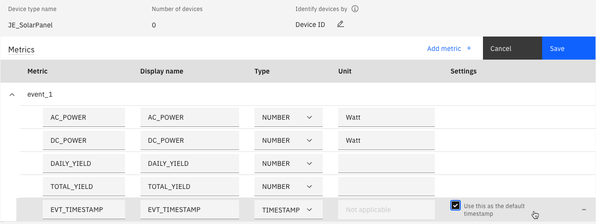
9. 点击Save

## 在IoT中创建网关并注册设备

1. 点击右上角的AppSwitcher并选择IoT 
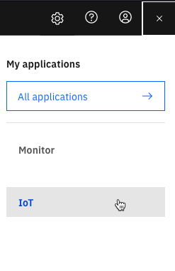
2. 点击Device Types
3. 点击Add Device Type
4. 点击Type Gateway
5. 输入网关类型的名称，例如XX_SolarPanel_GW（将XX替换为您的姓名首字母缩写）。 
   记下您给出的名称，因为您将在Node-RED流配置中需要它
5. 点击Next
6. 点击Finish
7. 点击Register Devices
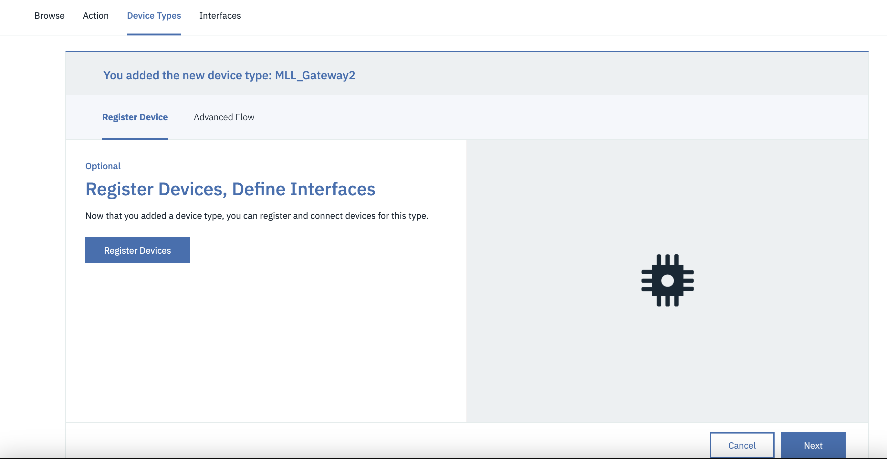
8. 输入网关设备的名称，例如XX_SolarPanel_GW01（将XX替换为您的姓名首字母缩写）。 
注意：这不是CSV文件中的DEVICEID
9. 点击Next 4次
13. 在Authentication Token中输入Pasword1!并点击Next
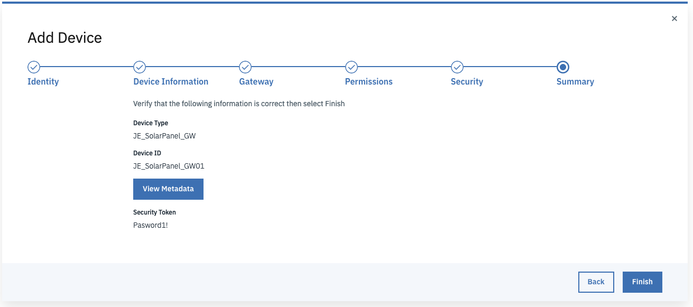
14. 点击Finish
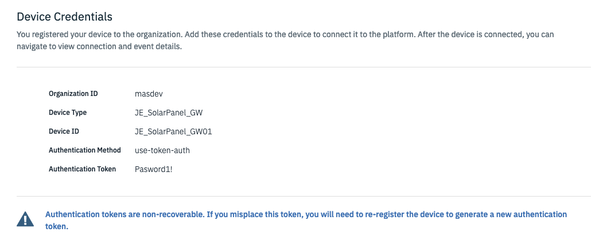

## 导入Node-RED流以导入CSV

!!! tip
    如果您已经完成了上一个练习，则跳到[下一步](#update-the-device-type)并使用已导入的Node-RED脚本。

1. 下载[流](https://github.com/ekstrom-ibm/monitor_csv_importer/blob/main/V2/Monitor_CSV_to_MQTT_flow.json){target=_blank}，如果您已完成上一个设备练习，请跳过这些步骤
2. 启动Node-RED
3. 点击汉堡菜单并选择Import
4. 点击select a file to import
5. 选择步骤1中下载的文件。
6. 点击Import

## 配置Node-RED流"CSV to MQTT to Monitor through a gateway"

### 为您的MAS Monitor环境配置Node-RED流

收集以下信息（如果在上一个练习中完成则跳过）： 
* 上面创建的设备类型的名称 
* Messaging主机名应如下所示 
&ensp;[tenant/workspace].messaging.iot.[domain] 
&ensp;例如masdev.messaging.iot.monitordemo2.ibmmam.com 

### 更新设备类型

1. 在Initialization部分双击"Set Flow Data"`function`节点
2. 将deviceType更改为您之前创建的设备类型， 
   例如XX_SolarPanel（将XX替换为您的姓名首字母缩写）。
3. 点击Done

### 更新Client ID

1. 双击名为 `Send MQTT event to a gateway in MAS Monitor`的紫色`mqtt out`节点
2. 点击Server旁边的铅笔图标
3. 在Server框中替换为您的Messaging主机名
4. 点击TLS configuration旁边的铅笔图标
5. 在Server Name框中替换为您的Messaging主机名
6. 取消选中`Verify server certificate`并点击Update
7. 网关的Client ID如下所示：`g:<tenant>:<device type>:<device ID>`
8. 在Client ID字段中，如果不相同，将masdev替换为您的租户/工作区名称
9. 在Client ID字段中将XX_SolarPanel_GW替换为上面创建的网关设备类型
10. 在Client ID字段中将XX_SolarPanel_GW01替换为上面创建的网关的设备ID
11. 点击Security选项卡，输入`use-token-auth`作为用户名 
    并输入`Pasword1!`作为密码
12. 点击Update
13. 点击Done
14. 点击右上角的Deploy
15. 如果所有凭据输入正确，您现在应该在`mqtt out`节点下方看到一个绿点和`connected`： 
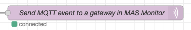

## 为网关运行Node-RED流

1. 从github下载[multiple_solar_panels.csv](https://github.com/ekstrom-ibm/monitor_csv_importer/blob/main/V2/multiple_solar_panels.csv){target=_blank}
2. 点击Node-RED右上角的向下箭头并选择Dashboard 
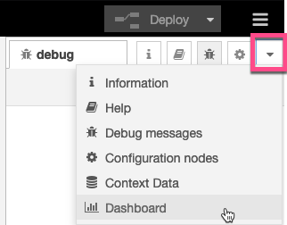
3. 点击启动箭头 
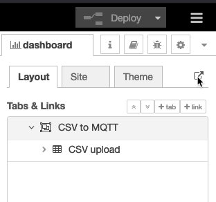
4. 点击"Upload CSV with multiple devices"下的Choose File或Browse并选择最近下载的CSV文件。 
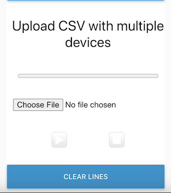
5. 选择`multiple_solar_panels.csv`文件并点击右箭头播放按钮
6. 返回Node-RED流窗口
7. 在浅紫色`delay`节点下方显示剩余要发送到Monitor的消息数量
8. 在绿色`debug` Progress节点下方显示已发送到Monitor的消息数量
9. 一旦浅紫色`delay`节点下方的数字 
   显示0，所有数据就被导入Monitor，但您可以继续下一步以验证数据正在进入Monitor。 
   大约需要11分钟。 
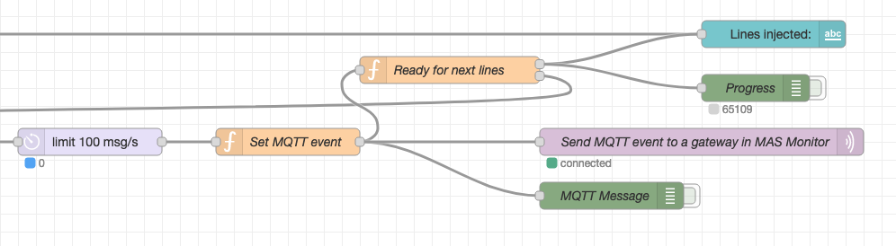

## 验证设备和数据在Monitor中

1. 在Monitor中转到Setup
2. 点击实验中较早创建的设备类型
3. 查看在设备类型下创建了21个（+1个来自上一个练习）设备
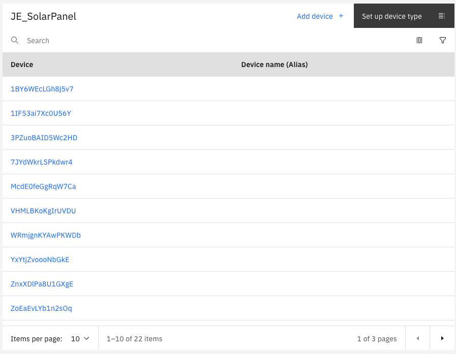
3. 点击黑色按钮"Set up device type"
4. 在左侧打开Metric，然后选择DAILY_YIELD
5. 点击Data table查看该指标的值并注意不同的Device ID 
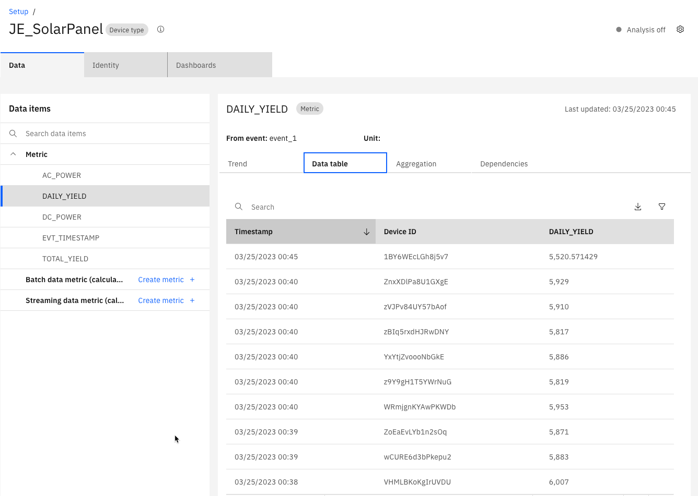

---

恭喜！您已通过网关将CSV文件中的数据导入Monitor的多个设备。
现在您可以探索在Monitor中创建计算数据指标和仪表板。 
可能是这样的： 
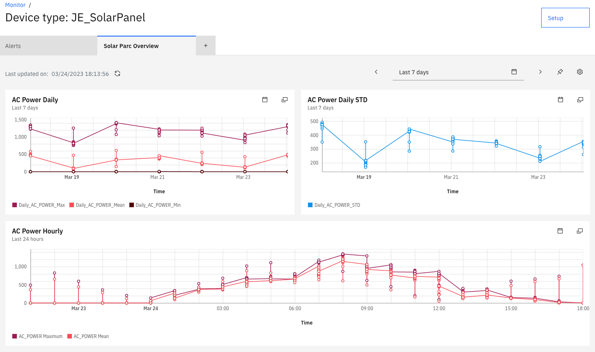  

!!! attention
    不再使用时，请归档并删除您的设备类型。