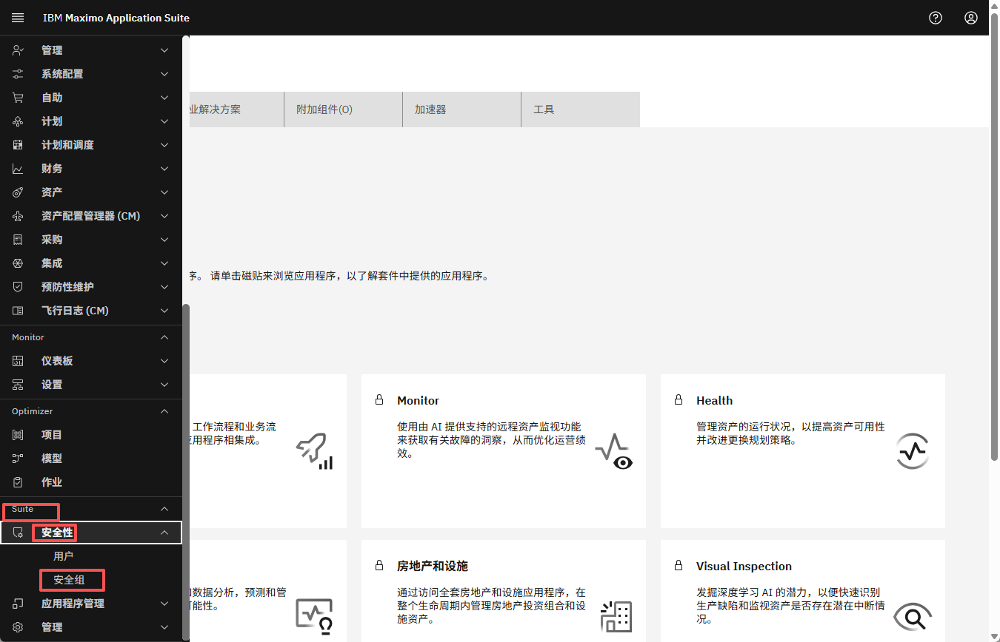
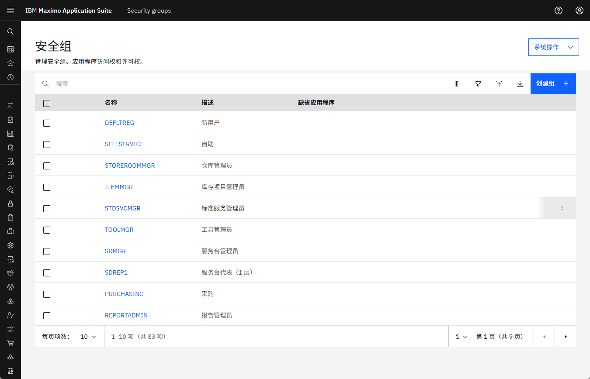
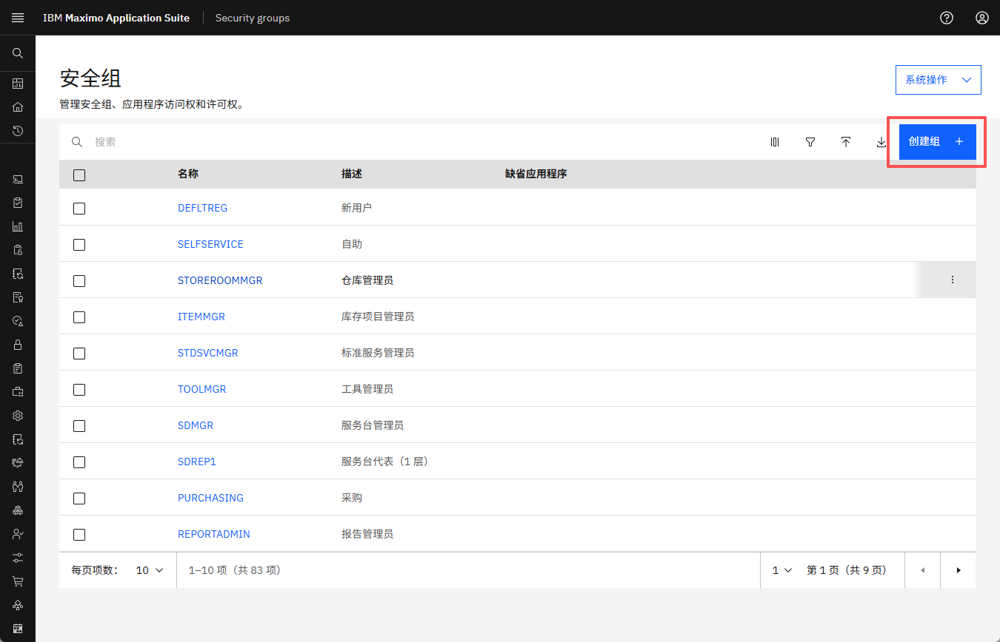
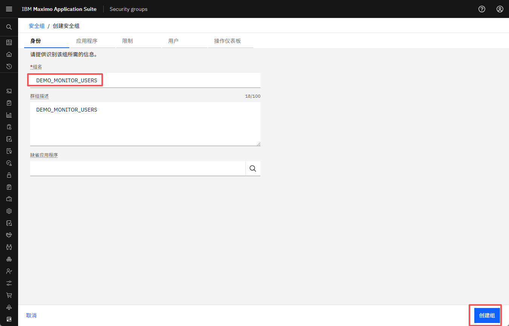
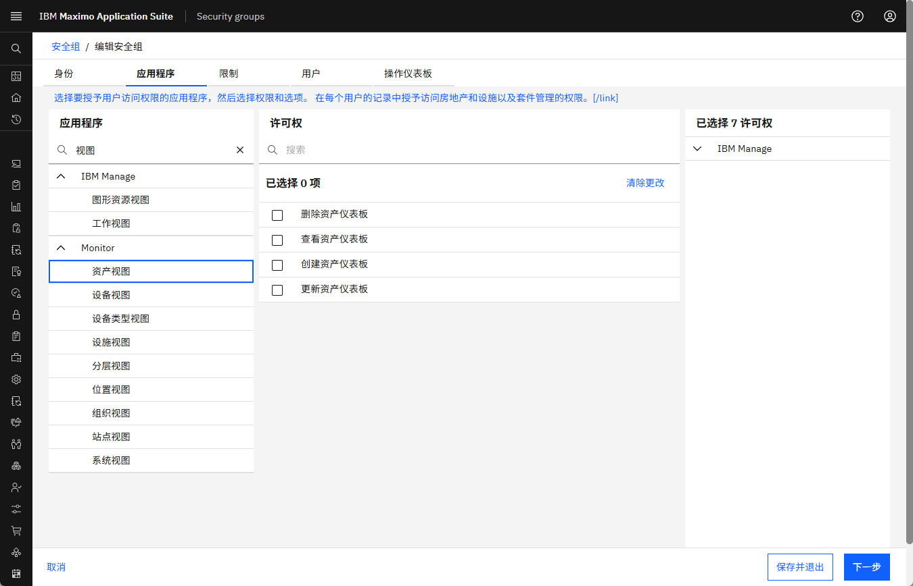
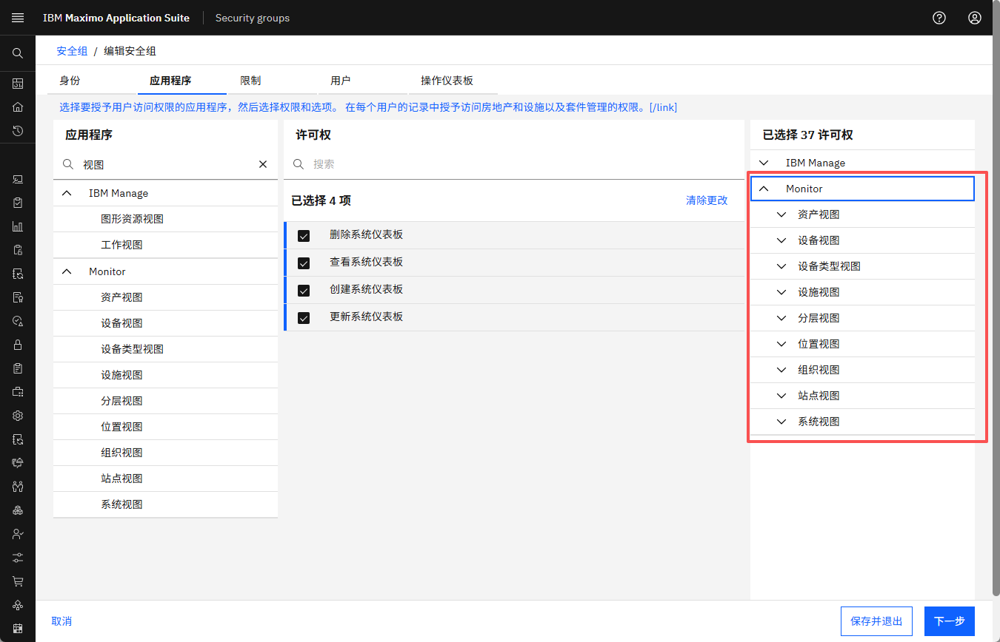

# 目标
在本练习中，您将学习如何：

* 在Monitor中创建新的安全组
* 为用户定义基于角色的权限

---

*开始之前：*  
本练习假设您已经：

1. 拥有Maximo Monitor的管理员访问权限
2. 完成了[介绍部分](./index.md)中的RBAC概述

---

Monitor中的安全组定义用户可以访问哪些页面和功能。通过创建安全组，您可以强制执行基于角色的权限，如管理员、查看者或有限的仪表板访问权限。

---

### 步骤1：导航到安全组

1. 使用管理员用户登录Monitor
2. 转到**Suite → 安全性 → 安全组**

 
 

---

### 步骤2：创建新的安全组

1. 点击**创建组**    
 

2. 输入组的名称，例如`DEMO_MONITOR_USERS`并点击**创建组**  
 

3. 提供简短的组描述（可选）

---

### 步骤3：分配权限

1. 选择此组应有权访问的功能/模块
   示例：
   – 启用仪表板访问
   – 启用仪表板上的CRUD操作
   – 禁用设置页面访问
2. 配置权限后保存组

3. 搜索"视图"，所有视图页面将出现。选择所有权限以使安全组能够查看和仅访问仪表板页面。

 

- 可以在详细信息/编辑安全组部分查看已分配的权限 
   
    

 

---

### 开箱即用安全组示例 

MONITOR_ADMIN、MONITOR_USERS和MONITOR_READ_ONLY是开箱即用的安全组，客户可以更改它们，也可以根据需要创建新的安全组。

| 组名称          | 用途                                 | 访问范围                      |
|---------------------|------------------------------------------|------------------------------------|
| MONITOR_ADMIN       | 完全管理员访问                       | 所有页面（仪表板 + 设置）      |
| MONITOR_USERS       | 标准用户                           | 仅仪表板（允许CRUD）      |
| MONITOR_READ_ONLY   | 只读角色                           | 仅查看仪表板（无CRUD）      |

---

恭喜！
您已成功创建安全组。接下来，您可以继续[创建用户并分配组](create_users.md)

---