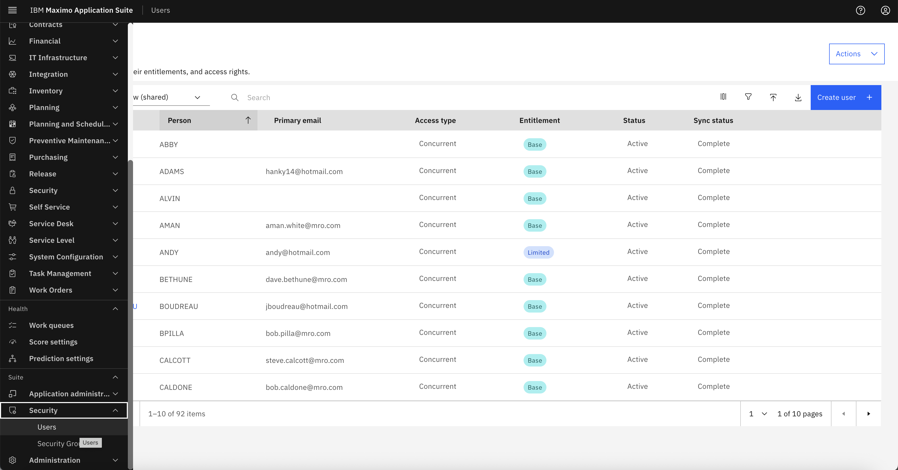
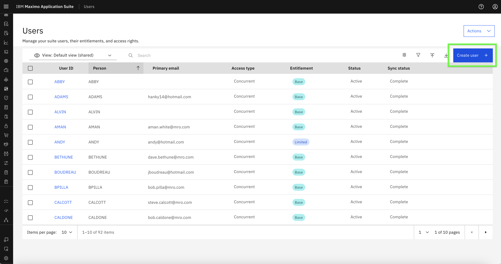
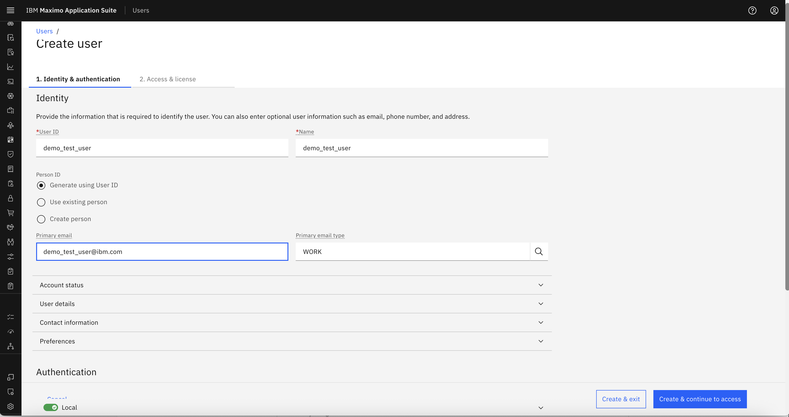
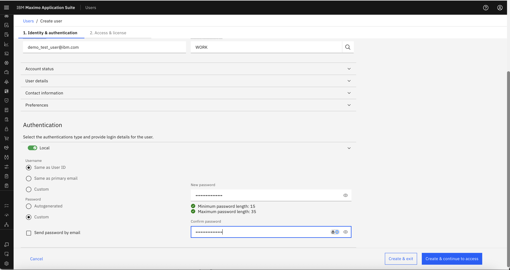
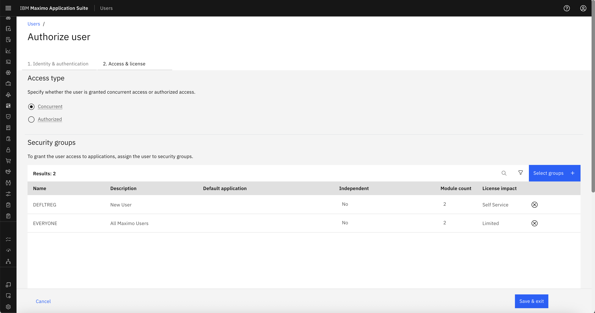
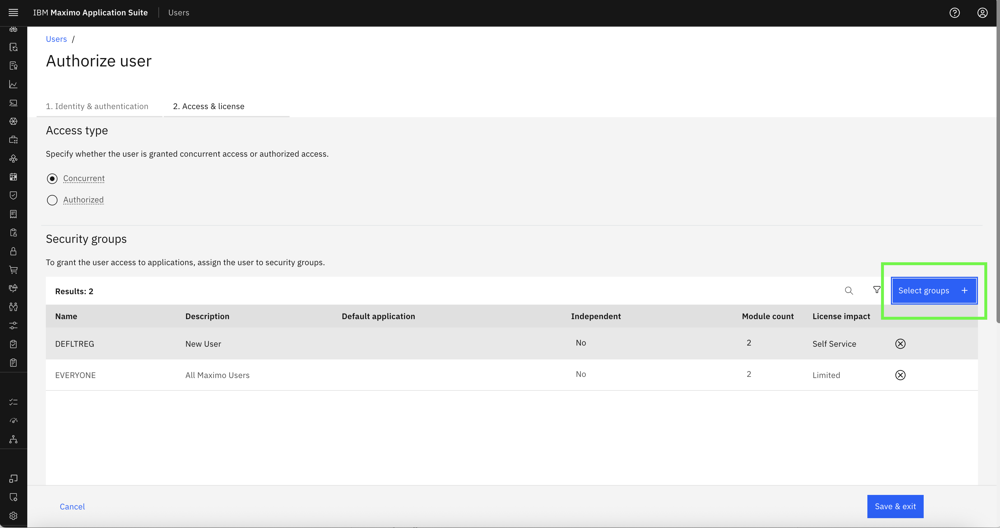
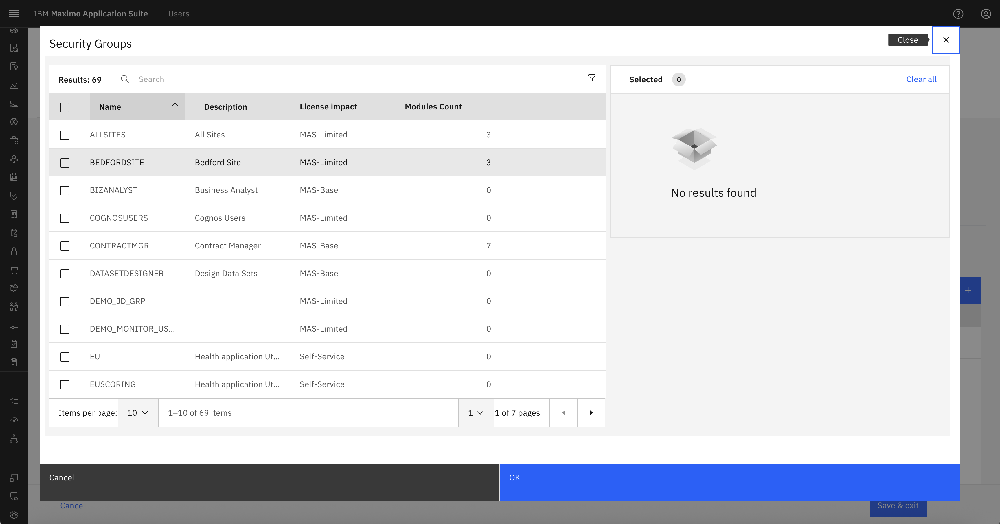
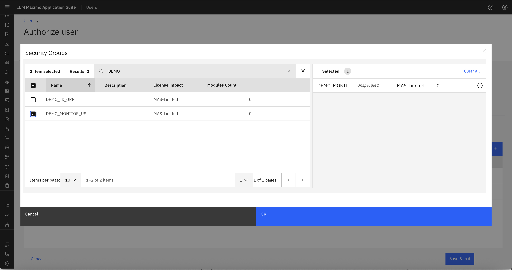
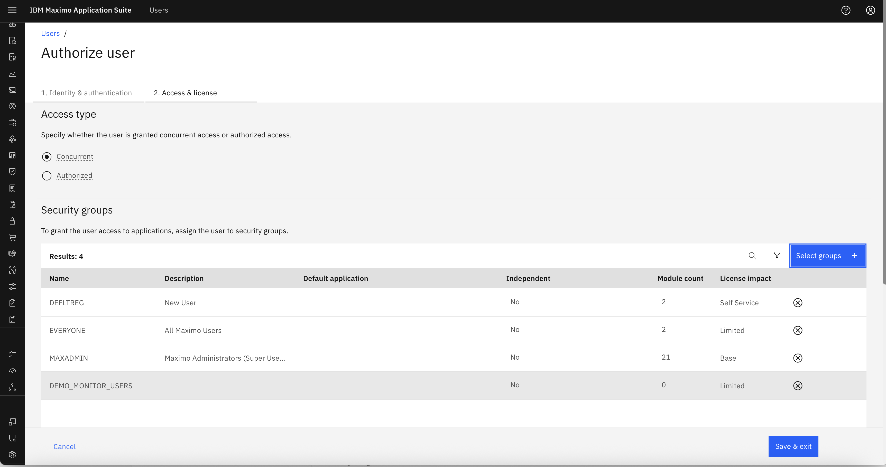
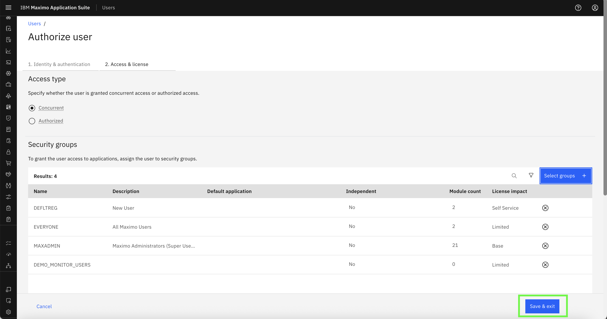

# 目标
在本练习中，您将学习如何：

* 在Monitor中创建用户
* 将用户分配到适当的安全组
* 了解多个组分配的效果

---

*开始之前：*  
本练习假设您已经：

1. 完成了[创建安全组](create_security_groups.md)中的步骤
2. 拥有Maximo Monitor的管理员访问权限

---

Monitor中的用户必须分配到一个或多个安全组以确定其访问权限。这些组的组合定义了用户可以看到和交互的功能。

---

### 步骤1：导航到用户管理

1. 使用管理员用户登录Monitor
2. 转到**Suite → Security → Users**

 

---

### 步骤2：创建新用户

1. 点击**Create User**

 

2. 填写必填字段：**User ID**、**Name**、**Primary email**
    

   - **Password** 选择Custom Password以创建您选择的密码。 
    

3. 点击**Create & Continue to access**以继续进行安全组分配 

    

---

### 步骤3：分配安全组

1. 在"Authorize User"部分，点击Selects groups： 
   
    

    

   - 对于**只读用户**，选择：
     - `MONITOR_READ_ONLY`
     - `MAXADMIN` *（查看从Manage获取数据的页面）*
   - 对于**普通用户**，选择：
     - `MONITOR_USERS`
     - `MAXADMIN` *（查看从Manage获取数据的页面）*
   - 对于**完全管理员**，选择：
     - `MONITOR_ADMIN`
     - `MAXADMIN` *（查看从Manage获取数据的页面）*

- 搜索在上一节中创建的DEMO_MONITO_USERS（具有类似于MONITOR_USERS的访问权限）安全组并勾选选择 

 

- 搜索MAXADMIN安全组以使用户能够从Manage获取数据并勾选选择 
 

2. 点击**Save & exit**

 

!!! tip
    用户可以分配**多个组**。所有分配组的权限会自动组合。

---

### 用户分配示例

| 用户名       | 分配的安全组          | 有效权限                         |
|----------------|------------------------------------|------------------------------------------------|
| `readonly_user` | MONITOR_READ_ONLY, MAXADMIN       | 仅查看仪表板，无设置访问权限           |
| `normal_user`   | MONITOR_USERS, MAXADMIN           | 完整的仪表板CRUD，无设置访问权限           |
| `admin_user`    | MONITOR_ADMIN, MAXADMIN                     | 完全访问仪表板和设置             |

---

恭喜！
您已成功创建用户并将其映射到适当的安全组。继续下一步以[验证用户访问行为](user_access_behavior.md)

---