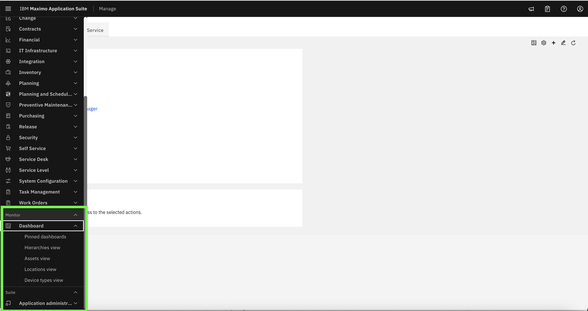
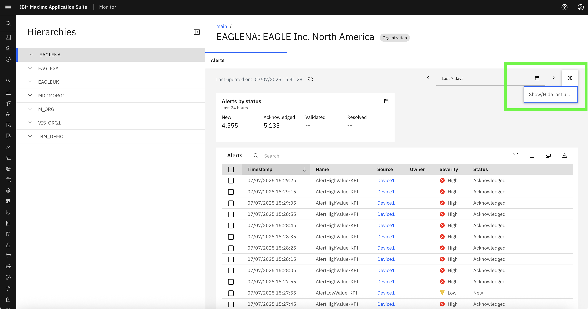
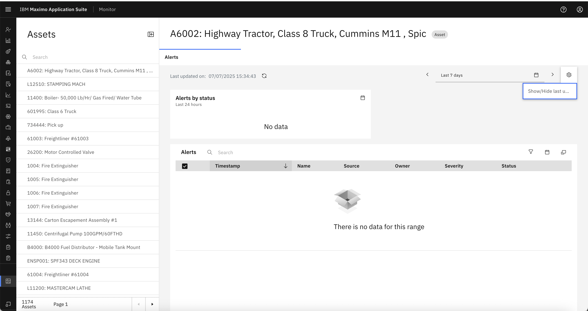
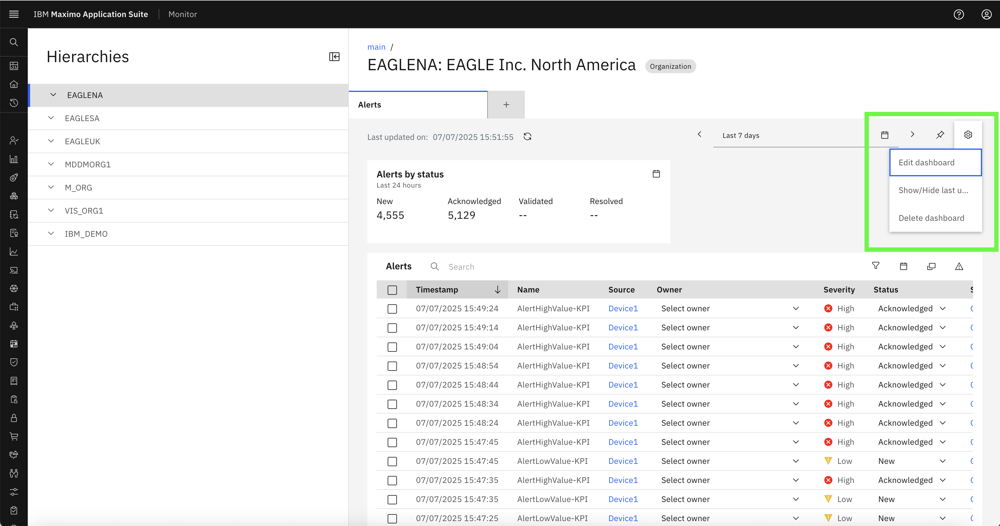
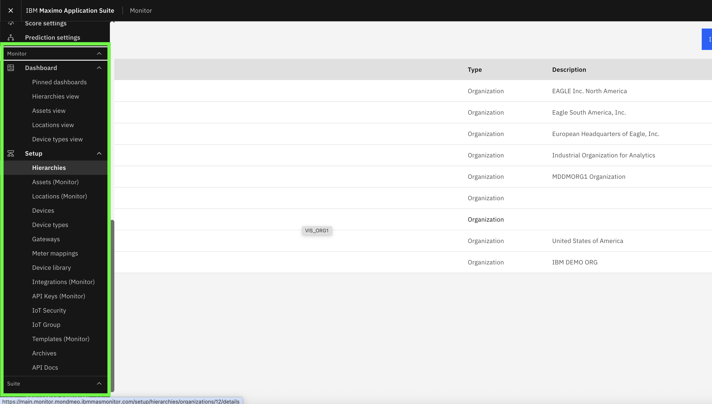
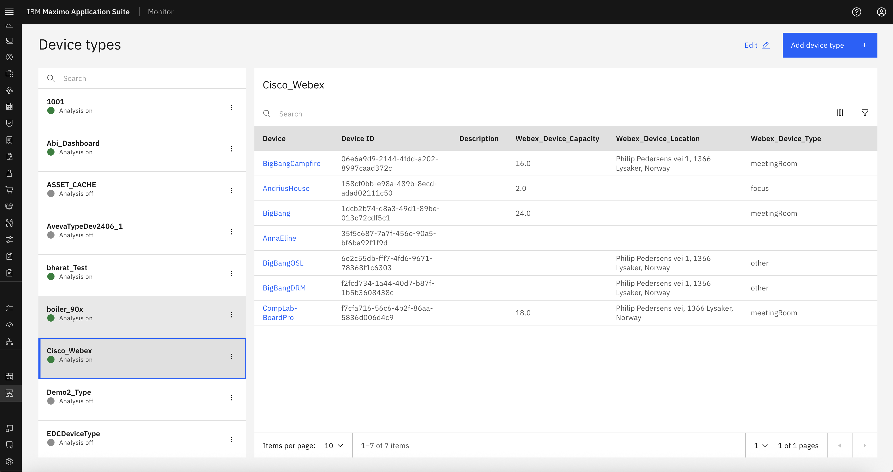
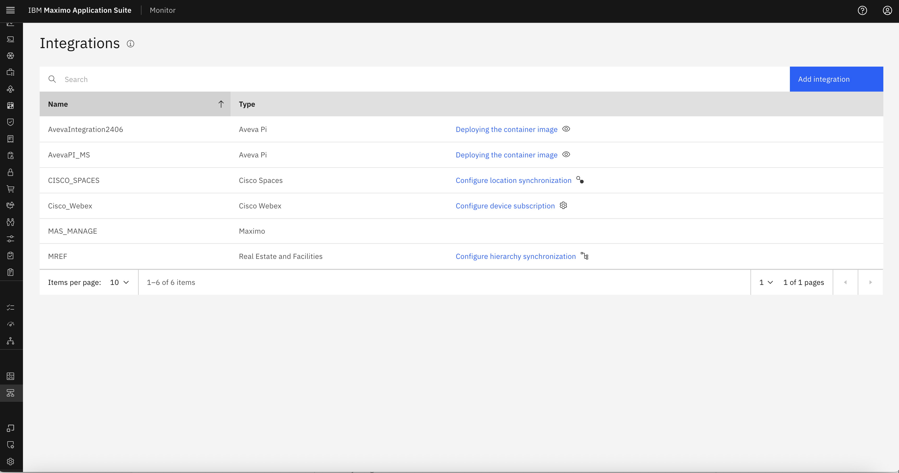

# 目标
在本练习中，您将学习如何：

* 以具有不同角色的用户身份登录
* 根据分配的安全组观察和比较UI行为
* 了解RBAC如何在Monitor中强制执行访问控制

---

*开始之前：*  
本练习假设您已经：

1. 完成了[创建安全组](create_security_groups.md)
2. 完成了[创建用户并分配组](create_users.md)

---

RBAC控制用户如何体验Monitor应用程序。根据其分配的安全组，用户将看到**不同的UI**，并且将启用**不同级别的功能**。

---

### 场景1：只读用户访问

**用户信息：**
- 用户名：`readonly_user`
- 组：`MONITOR_READ_ONLY`、`MAXADMIN`

**预期行为：**
- 可以**查看仪表板页面**
- 不能**创建**、**编辑**或**删除**条目
- **设置页面**（如安全、设备类型等）**不可见**

 

!!! info
    请注意，CRUD按钮（如添加/编辑/删除）不可用，并且设置在左侧菜单中隐藏。

---

- 用户只能查看仪表板，不能进行任何更改： 

 
 

### 场景2：普通用户访问

**用户信息：**
- 用户名：`normal_user`
- 组：`MONITOR_USERS`、`MAXADMIN`

**预期行为：**
- 可以访问**仪表板页面**
- 可以对仪表板执行**CRUD操作**
- 不能访问设置页面

 

!!! tip
    此角色非常适合管理仪表板数据但不应修改系统配置的操作用户。

---

- 用户可以访问以及编辑仪表板 
 

### 场景3：管理员用户访问

**用户信息：**
- 用户名：`admin_user`
- 组：`MONITOR_ADMIN`、`MAXADMIN`

**预期行为：**
- 完全访问**仪表板和设置**
- 可以创建/编辑/删除仪表板和设置页面。

 

!!! note
    管理员可以看到所有模块，并可以管理用户和系统级配置。

---

- 用户可以对仪表板执行CRUD操作： 
 

- 用户可以访问所有设置页面，如设备类型、集成等： 
   

- 集成： 
 

### 开箱即用安全组的摘要比较。

| 角色           | 仪表板访问 | CRUD操作 | 设置访问 | 分配的组                    |
|----------------|------------------|-----------------|--------------|------------------------------------|
| 只读用户  | ✅ 仅查看      | ❌ 否            | ❌ 否         | MONITOR_READ_ONLY, MAXADMIN        |
| 普通用户    | ✅ 完全访问    | ✅ 是           | ❌ 否         | MONITOR_USERS, MAXADMIN            |
| 管理员用户     | ✅ 完全访问    | ✅ 是           | ✅ 完全       | MONITOR_ADMIN, MAXADMIN            |

---

恭喜！
您已成功验证了用户访问行为如何根据分配的RBAC角色而变化。

---